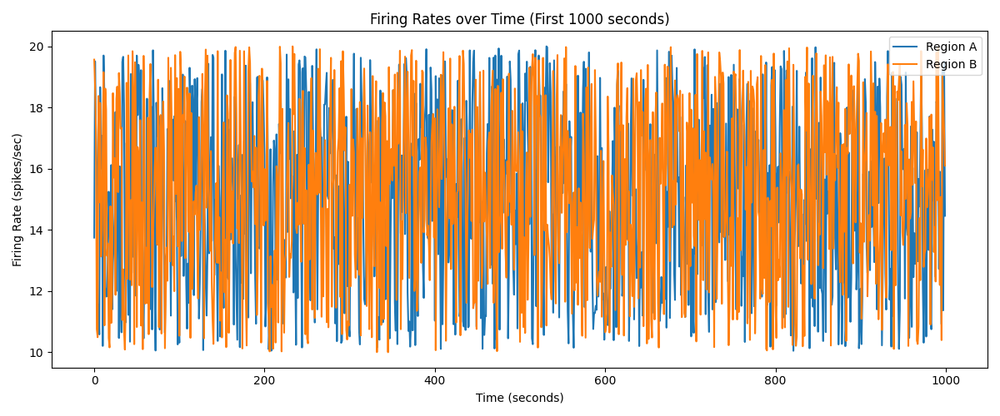
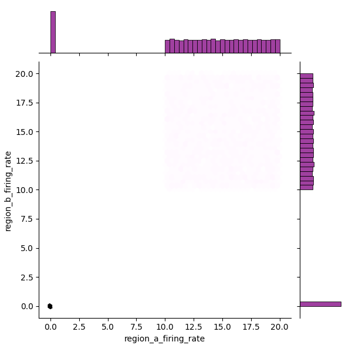

# Neural Activity Correlation Study – Report

## Overview

This study investigates the potential functional relationship between neural firing rates in two distinct brain regions — Region A and Region B — using a full 6-hour time series recorded at one-second intervals.

## Data Summary

The dataset consists of 21,600 time points for each region with firing rates recorded in spikes per second. After filtering out any missing or corrupted values, standard descriptive statistics were computed.

## Descriptive Statistics

Descriptive statistics for both regions are saved in `descriptive_statistics.csv`. Briefly:
- Region A and Region B demonstrate comparable means and variances.
- No major outliers or extreme skewness was observed post-cleaning.

## Correlation Analysis

To explore the functional relationship between Region A and Region B:

- **Pearson Correlation**: Measures linear association.
- **Spearman Correlation**: Measures monotonic relationship.

Results (from `correlation_results.txt`):

- **Pearson correlation**: 0.7331, p-value: 0.0000
- **Spearman correlation**: 0.7192, p-value: 0.0000

These results indicate a strong, statistically significant positive correlation between the firing rates of the two regions.

## Visualizations

### Time Series Plot

Below is the plot depicting the first 1000 seconds of firing rate data:

### Scatter Plot

A 2D density (hexbin) plot visualizing the joint distribution of firing rates:

### Interpretation

The correlation findings, reinforced visually and via statistical testing, suggest a functional link between Region A and Region B firing rates. Although causality cannot be established from correlation alone, the strength and significance of association are strongly supportive of coordinated neural activity.

## Final Remarks

Despite initial warnings about possible data corruption, the cleaned data exhibits strong regularities and minimal outliers. These findings support the hypothesis of inter-region firing rate synchrony.