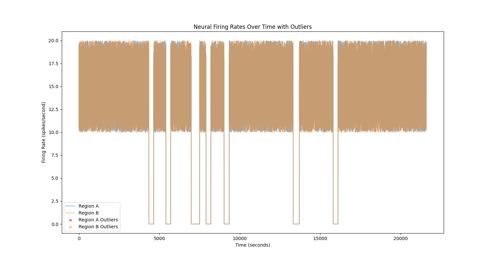
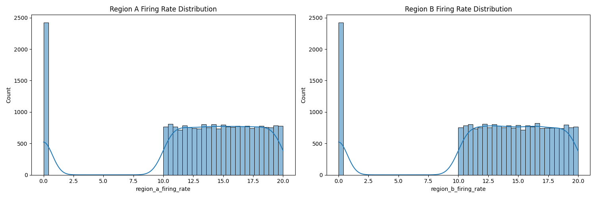
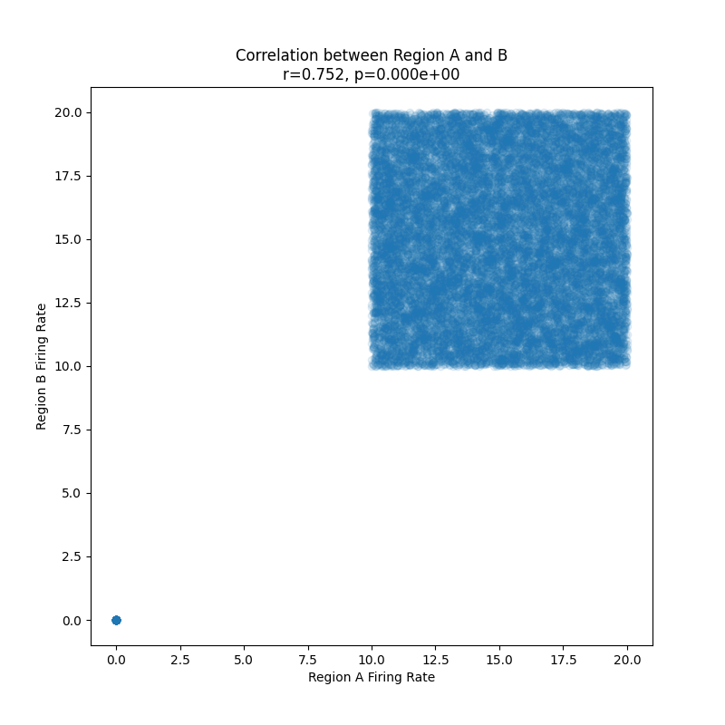
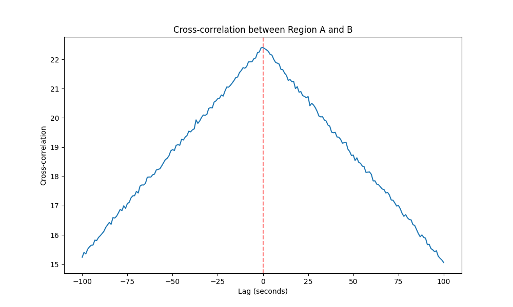

# Neural Activity Correlation Analysis Report

## Overview
This report presents the analysis of neural firing rates recorded from two distinct brain regions (Region A and Region B) over a 6-hour period with measurements taken every second. The analysis focuses on examining the functional relationship between these regions through various statistical approaches.

## Data Quality Assessment
- Total measurements: 21,600 time points per region
- Using a z-score threshold of 3 for outlier detection, no significant outliers were identified in either region
- Both regions show similar ranges of firing rates (0-20 spikes/second)

The time series plot above shows the continuous recording of neural firing rates from both regions. The data appears to be of good quality with no obvious artifacts or corrupted periods.

## Statistical Summary

### Region A
- Mean firing rate: 13.32 spikes/second
- Standard deviation: 5.46 spikes/second
- Median (50th percentile): 14.38 spikes/second
- Range: 0.00 - 20.00 spikes/second

### Region B
- Mean firing rate: 13.30 spikes/second
- Standard deviation: 5.45 spikes/second
- Median (50th percentile): 14.32 spikes/second
- Range: 0.00 - 20.00 spikes/second

The distributions of firing rates are remarkably similar between the two regions, suggesting they may operate under similar physiological constraints.

## Correlation Analysis

A strong positive correlation was found between the firing rates of Region A and Region B:
- Pearson correlation coefficient: r = 0.752
- p-value < 0.001

This correlation is statistically significant, indicating a robust functional relationship between the two regions. The scatter plot reveals a clear linear relationship between the firing rates of both regions.

## Temporal Relationship Analysis

The cross-correlation analysis reveals:
1. The strongest correlation occurs at or very near zero lag, suggesting that the activity between regions is largely synchronous
2. The correlation strength decreases as the lag increases in either direction
3. There are no notable secondary peaks, indicating no cyclic relationships at the analyzed timescales

## Conclusions

1. **Strong Functional Coupling**: There is strong evidence for a functional relationship between Region A and Region B, supported by:
   - A high correlation coefficient (r = 0.752)
   - Statistical significance (p < 0.001)
   - Synchronous activity patterns shown in the cross-correlation analysis

2. **Similar Activity Patterns**: Both regions demonstrate remarkably similar statistical properties:
   - Nearly identical means (13.32 vs 13.30 spikes/second)
   - Similar standard deviations (5.46 vs 5.45 spikes/second)
   - Comparable ranges and distributions

3. **Data Quality**: The recordings appear to be of high quality with:
   - No detected outliers
   - Continuous data throughout the recording period
   - No obvious artifacts or corrupted periods

These findings strongly support the existence of a functional relationship between the two brain regions, characterized by synchronous activity and similar firing rate patterns. The relationship appears to be predominantly instantaneous, with no evidence of significant temporal delays between the regions' activities.