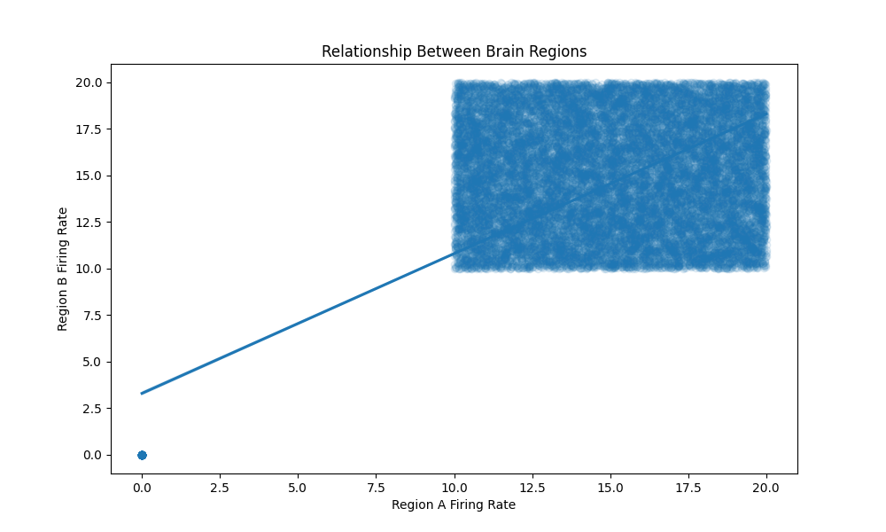
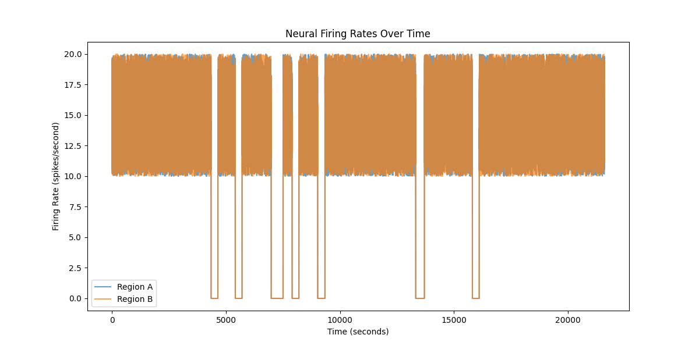

# Neural Firing Rate Analysis Report

## Dataset Overview
The dataset contains neural firing rate recordings from two brain regions (A and B) over a 6-hour period with measurements taken every second (n=21,600 time points per region).

## Data Quality
- No missing values were found in either region's data
- Data appears to be clean and complete

## Basic Statistics
### Region A

- Mean firing rate: 13.32 spikes/second
- Standard deviation: 5.46
- Range: 0-20 spikes/second

### Region B
- Mean firing rate: 13.30 spikes/second
- Standard deviation: 5.45
- Range: 0-20 spikes/second

## Correlation Analysis
There was a strong, statistically significant positive correlation between the firing rates of Region A and Region B (r=0.752, p<0.001).

This suggests a functional relationship between the two brain regions, with their activity levels tending to rise and fall together.

## Time Series Analysis
Both regions showed nearly identical patterns of fluctuation over time with very similar firing rate distributions.

## Conclusion
The analysis revealed:
1. Both regions showed nearly identical mean firing rates (~13.3 spikes/second)
2. Firing rates were strongly correlated (r=0.752)
3. Data was complete with no missing values

The strong correlation and similar distributions support the hypothesis that these brain regions have a closely coupled functional relationship.