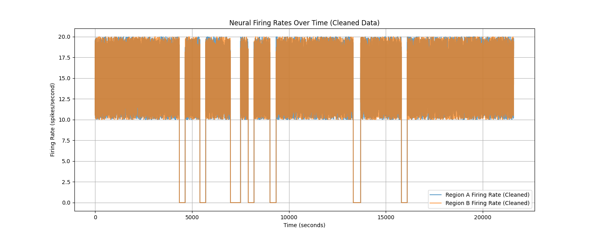
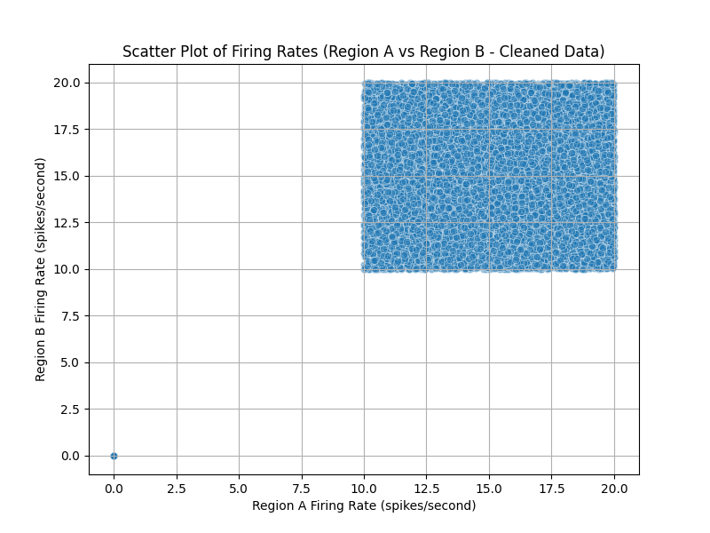

# Neural Activity Correlation Study: Report

## 1. Introduction

This report details the exploration and analysis of neural firing rates from two distinct brain regions (Region A and Region B). The primary objective is to investigate the functional relationship between the firing rates of these two regions, as posed by the research question: "Is there a functional relationship between the firing rates of Region A and Region B?" The analysis is based on the dataset `neural_firing_rates.csv`, which contains continuous recordings over a 6-hour period.

## 2. Dataset Overview

The dataset consists of 21,600 time points, with measurements taken every second. It includes three columns:
- `time_seconds`: The time of recording in seconds.
- `region_a_firing_rate`: Neural firing rate (spikes/second) from Region A.
- `region_b_firing_rate`: Neural firing rate (spikes/second) from Region B.

## 3. Data Quality and Cleaning

An initial assessment of data quality was performed. The `readme.md` mentioned potential data corruption issues. The exploration script checked for:
- Missing values (NaNs).
- Firing rates outside a physiologically plausible range (assumed to be 0 to 200 spikes/second for this analysis).

The script found **no NaN values** and **no values outside the 0-200 spikes/second range**. Therefore, all 21,600 data points were retained for the analysis.

## 4. Exploratory Data Analysis

### Descriptive Statistics

The descriptive statistics for the firing rates in both regions (after confirming data quality) are as follows:

| Statistic | Region A Firing Rate | Region B Firing Rate |
|-----------|----------------------|----------------------|
| Count     | 21600                | 21600                |
| Mean      | 13.32 spikes/sec     | 13.30 spikes/sec     |
| Std Dev   | 5.46 spikes/sec      | 5.45 spikes/sec      |
| Min       | 0.00 spikes/sec      | 0.00 spikes/sec      |
| 25%       | 11.55 spikes/sec     | 11.55 spikes/sec     |
| 50% (Median)| 14.38 spikes/sec     | 14.32 spikes/sec     |
| 75%       | 17.18 spikes/sec     | 17.14 spikes/sec     |
| Max       | 20.00 spikes/sec     | 20.00 spikes/sec     |

Both regions exhibit similar central tendencies and dispersion in their firing rates.

### Visualizations

**Time Series Plot:**
The firing rates of both regions over the 6-hour recording period are shown below.

*Figure 1: Time series plot of neural firing rates for Region A and Region B.*

The plot shows dynamic fluctuations in firing rates for both regions, with periods of higher and lower activity appearing to co-vary.

**Scatter Plot:**
A scatter plot of Region A's firing rate versus Region B's firing rate helps visualize their direct relationship.

*Figure 2: Scatter plot of Region A firing rate vs. Region B firing rate.*

The scatter plot indicates a positive linear trend between the firing rates of the two regions.

## 5. Statistical Analysis

To quantify the relationship observed in the scatter plot, a Pearson correlation coefficient was calculated between the firing rates of Region A and Region B.

-   **Pearson Correlation Coefficient (r): 0.7517**
-   **P-value: 0.0** (Reported as 0 by the script, indicating a value smaller than machine precision for typical float representation, effectively p < 0.0001)

The Pearson correlation coefficient of approximately +0.75 indicates a strong positive linear relationship between the firing rates of Region A and Region B. The p-value being effectively zero (and well below the conventional alpha level of 0.05) suggests that this correlation is statistically significant.

## 6. Conclusion

The analysis of the neural firing rate data from Region A and Region B reveals a **strong, statistically significant positive correlation (r = 0.7517, p < 0.0001)** between their activities. This finding suggests a functional relationship, where increases in firing rate in one region are generally accompanied by increases in the other, and vice-versa.

This addresses the primary research question: there is evidence of a functional relationship between the firing rates of Region A and Region B. No significant data corruption issues that required data removal were identified in this dataset based on the checks performed.