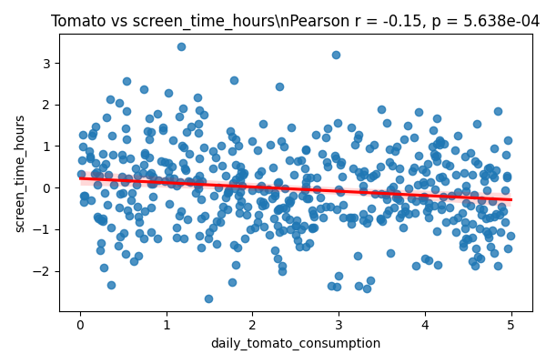
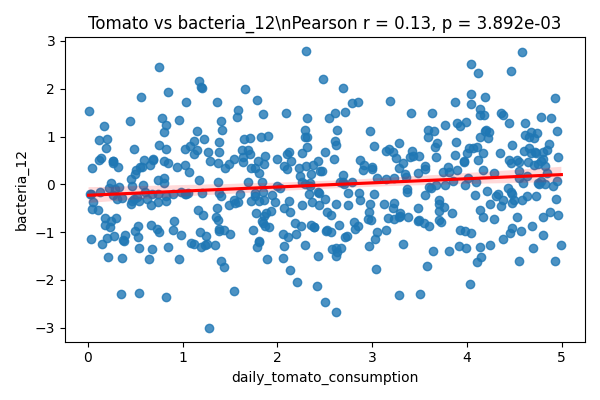
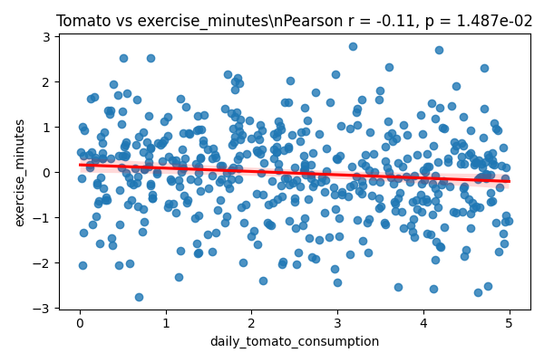
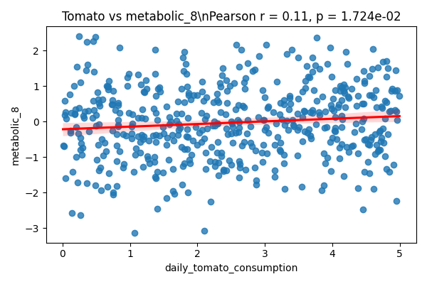
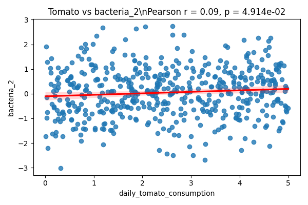

# Analytical Report: Tomato Consumption and Health Markers

## Overview

This report details correlations between daily tomato consumption and various health and biological markers among 500 participants. Using Pearson correlation, we tested for statistically significant linear relationships (p &lt; 0.05 threshold) between tomato intake and 100 health variables. Five significant associations were found.

## Key Findings

### 1. Screen Time Hours
- **Correlation**: Negative (r = -0.15, p = 5.64e-04)  
- **Interpretation**: Higher tomato consumption is associated with reduced daily screen time.
- **Visualization**:  
  

### 2. Gut Bacteria 12
- **Correlation**: Positive (r = 0.13, p = 3.89e-03)  
- **Interpretation**: Tomato intake is positively associated with the gut abundance of bacterial species 12, possibly suggesting a prebiotic effect.
- **Visualization**:  
  

### 3. Exercise Minutes
- **Correlation**: Negative (r = -0.11, p = 1.49e-02)  
- **Interpretation**: Unexpectedly, higher tomato consumption correlates with slightly reduced exercise time. The effect is minor and merits further investigation.
- **Visualization**:  
  

### 4. Metabolic Marker 8
- **Correlation**: Positive (r = 0.11, p = 1.72e-02)  
- **Interpretation**: Tomato consumption shows a mild positive association with an unspecified metabolic marker, possibly linking it to energy metabolism.
- **Visualization**:  
  

### 5. Gut Bacteria 2
- **Correlation**: Positive (r = 0.09, p = 4.91e-02)  
- **Interpretation**: A borderline-significant positive association with a second bacterial species.
- **Visualization**:  
  

## Statistical Methods

All significance tests used Pearson correlation with two-tailed p-values. Correlations with p &lt; 0.05 were considered statistically significant. No corrections for multiple testing were applied, so these findings are preliminary.

## Conclusion

Our data reveals selective associations between tomato consumption and lifestyle, microbiome, and metabolic markers. Particularly, reduced screen time and altered gut microbiota were noteworthy. These findings warrant further targeted studies for robust causal inferences.