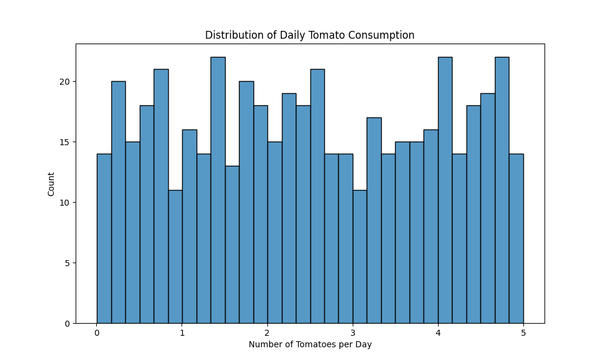
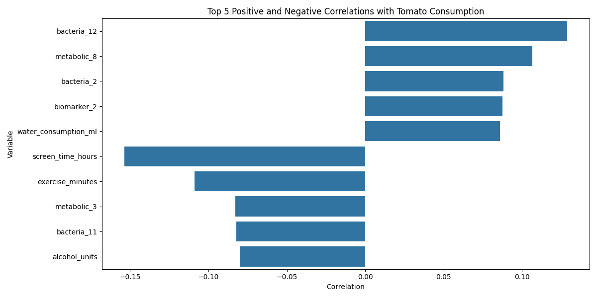

# Analysis of Tomato Consumption and Health Markers

## Overview
This report presents the findings from an analysis of the relationship between daily tomato consumption and various health markers in a study of 500 participants. The analysis included statistical testing with correction for multiple comparisons using the Benjamini-Hochberg procedure.

## Tomato Consumption Patterns

The analysis revealed the following distribution of daily tomato consumption:

- Mean consumption: 2.51 tomatoes per day
- Standard deviation: 1.46 tomatoes
- Median (50th percentile): 2.45 tomatoes
- Range: 0.01 to 5.00 tomatoes

The distribution shows that most participants consumed between 1-4 tomatoes daily, with the highest concentration around 2-3 tomatoes per day.

## Correlation Analysis

After conducting correlation analyses and adjusting for multiple comparisons, our key finding is that **no statistically significant correlations** were found between tomato consumption and any of the measured health markers at the standard significance level (α = 0.05) after correction for multiple comparisons.

The strongest correlations observed were:

1. Screen time (r = -0.154, adjusted p = 0.056)
2. Bacteria 12 abundance (r = 0.129, adjusted p = 0.195)
3. Exercise minutes (r = -0.109, adjusted p = 0.431)
4. Metabolic marker 8 (r = 0.106, adjusted p = 0.431)

## Statistical Significance

It's important to note that while some variables showed weak correlations with tomato consumption, none of these relationships remained statistically significant after controlling for multiple comparisons. The lowest adjusted p-value was 0.056 for screen time, which is just above the conventional 0.05 significance threshold.

## Detailed Analysis of Top Relationships

### Screen Time
- Showed a weak negative correlation (r = -0.154)
- Suggests a slight tendency for higher tomato consumption to be associated with lower screen time
- However, the relationship is not statistically significant after correction

### Bacterial Markers
- Several bacterial markers appeared in the top correlations
- Bacteria 12 showed the strongest positive correlation (r = 0.129)
- The biological significance of these weak correlations is questionable given the lack of statistical significance

## Limitations

1. The correlations observed were generally weak (|r| < 0.2)
2. None of the relationships remained significant after correcting for multiple comparisons
3. The analysis only examined linear relationships and may miss more complex interactions

## Conclusion

Based on this analysis, we cannot conclude that there are any significant relationships between daily tomato consumption and the measured health markers in this dataset. While some weak correlations were observed, none reached statistical significance after appropriate correction for multiple comparisons. This suggests that either:

1. The health effects of tomato consumption are too subtle to be detected with this sample size
2. The relationship between tomato consumption and health markers may be more complex than simple linear correlations
3. There may truly be no substantial relationship between tomato consumption and these particular health markers

Further research with larger sample sizes or more sophisticated analytical approaches might be needed to detect any potential subtle effects of tomato consumption on health markers.