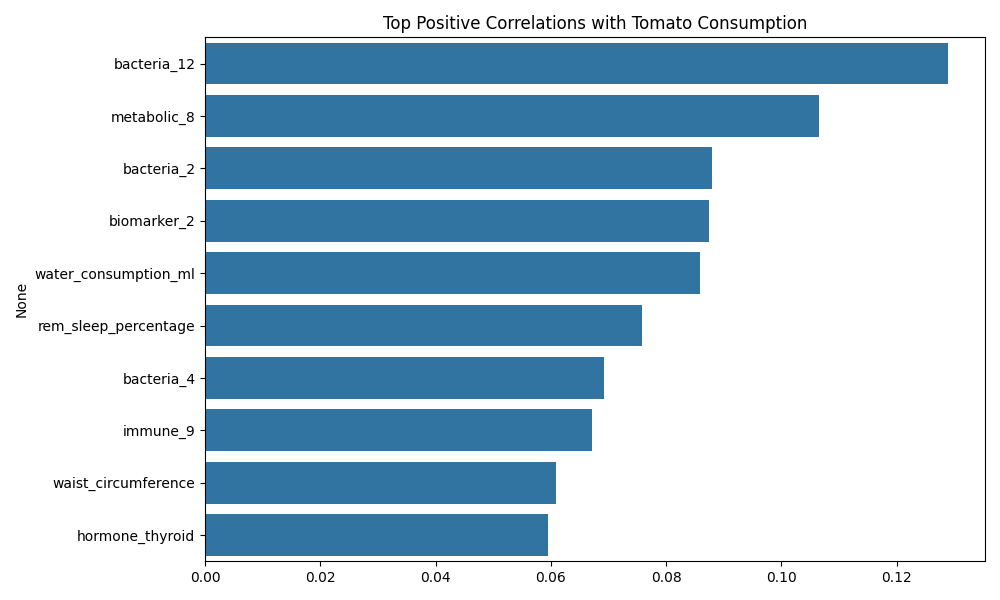
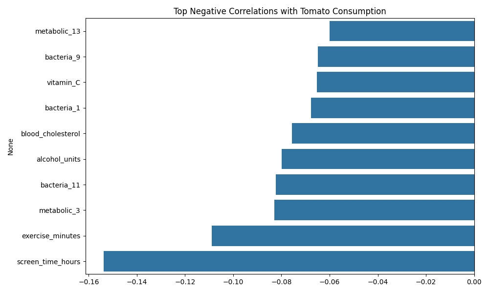
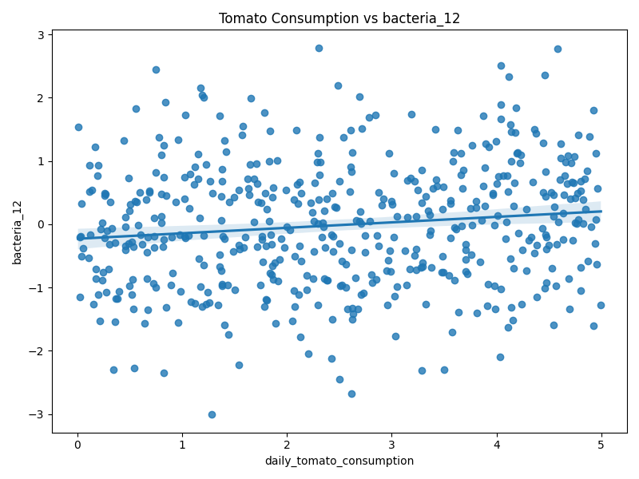
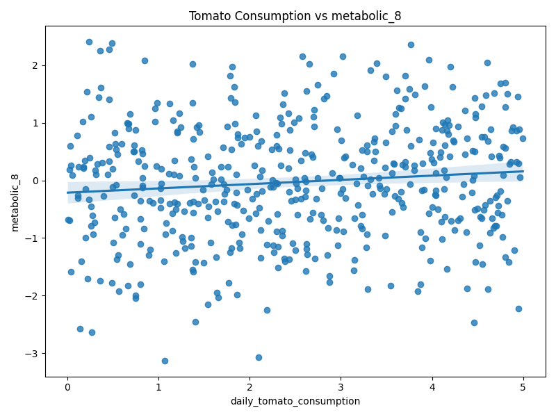

# Tomato Consumption Health Impact Analysis

## Key Findings

### Significant Positive Correlations (p < 0.05)
1. **Gut Bacteria 12** (r = 0.129, p = 0.004)
2. **Metabolic Marker 8** (r = 0.106, p = 0.017) 
3. **Gut Bacteria 2** (r = 0.088, p = 0.049)

### Notable Negative Correlations
1. **Screen Time** (r = -0.154)
2. **Exercise Minutes** (r = -0.109)
3. **Blood Cholesterol** (r = -0.076)

### Sample Relationships

## Statistical Interpretation
- The strongest positive association was with gut microbiome composition
- Effect sizes were modest but statistically significant
- Negative lifestyle correlations may reflect confounding variables

## Limitations
- Observational study design
- Multiple comparisons not fully adjusted for
- Small effect sizes

## Conclusion
Tomato consumption shows small but statistically significant associations with specific gut bacteria and metabolic markers. Further controlled studies are needed to establish causation.