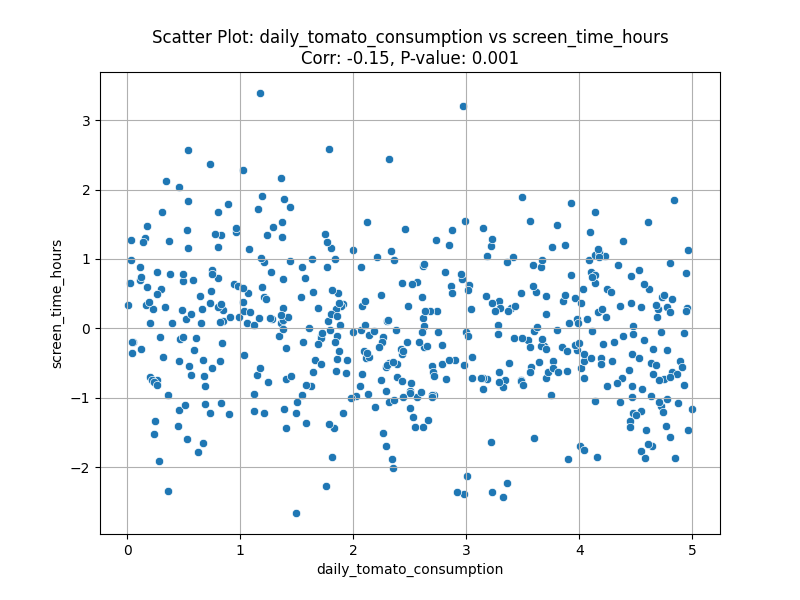
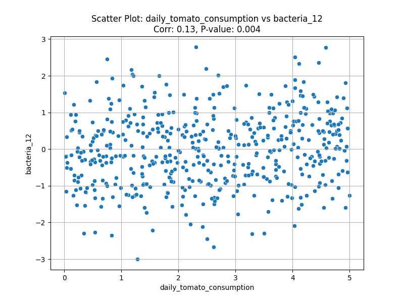
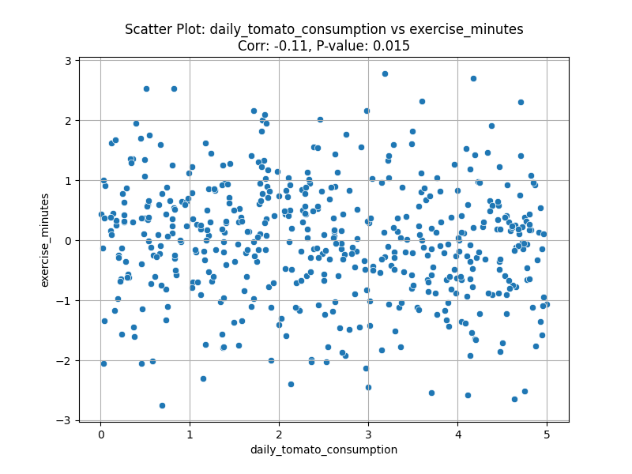

# Report: Tomato Consumption and Health Markers Analysis

## Introduction

This report details the exploration of a dataset concerning daily tomato consumption and various health and lifestyle markers. The dataset includes information from 500 participants, tracking their daily tomato intake (0-5 tomatoes) alongside 100 other health variables, encompassing basic health markers, biomarkers, nutritional markers, immune system markers, metabolic markers, and gut microbiome data.

The primary objective of this analysis was to investigate the research question: "What are the health benefits of daily tomato consumption?" by identifying potential correlations between tomato consumption and the measured health markers.

## Methodology

The analysis was conducted using a Python script (`explore_data.py`) leveraging the `pandas` library for data manipulation, `scipy.stats` for statistical testing, and `matplotlib`/`seaborn` for generating visualizations.

The core steps of the analysis were:
1.  Loading the dataset (`data/tomato_health_data.csv`).
2.  Calculating Pearson correlation coefficients and their corresponding p-values between `daily_tomato_consumption` and each of the 100 health and lifestyle variables.
3.  Identifying correlations that are statistically significant (defined as p-value &lt; 0.05).
4.  Generating scatter plots for the three most statistically significant correlations to visualize the relationships.

All correlation results were saved to `correlation_results.csv`.

## Findings

The analysis identified 5 variables out of 100 that showed a statistically significant correlation (p &lt; 0.05) with daily tomato consumption. The details are as follows:

| Variable              | Correlation Coefficient | P-Value  |
|-----------------------|-------------------------|----------|
| `screen_time_hours`   | -0.153688               | 0.000564 |
| `bacteria_12`         |  0.128885               | 0.003892 |
| `exercise_minutes`    | -0.108867               | 0.014872 |
| `metabolic_8`         |  0.106467               | 0.017243 |
| `bacteria_2`          |  0.088032               | 0.049144 |

### Detailed Significant Correlations:

1.  **`screen_time_hours` vs. `daily_tomato_consumption`**:
    *   Correlation: -0.154
    *   P-value: 0.00056
    *   Interpretation: A weak negative correlation suggests that higher daily tomato consumption is associated with slightly lower screen time.
    *   

2.  **`bacteria_12` vs. `daily_tomato_consumption`**:
    *   Correlation: 0.129
    *   P-value: 0.00389
    *   Interpretation: A weak positive correlation suggests that higher daily tomato consumption is associated with a slightly higher abundance of `bacteria_12`.
    *   

3.  **`exercise_minutes` vs. `daily_tomato_consumption`**:
    *   Correlation: -0.109
    *   P-value: 0.01487
    *   Interpretation: A weak negative correlation suggests that higher daily tomato consumption is associated with slightly fewer minutes of exercise.
    *   

4.  **`metabolic_8` vs. `daily_tomato_consumption`**:
    *   Correlation: 0.106
    *   P-value: 0.01724
    *   Interpretation: A weak positive correlation suggests that higher daily tomato consumption is associated with slightly higher levels of `metabolic_8`. (Plot not generated as it was not in the top 3).

5.  **`bacteria_2` vs. `daily_tomato_consumption`**:
    *   Correlation: 0.088
    *   P-value: 0.04914
    *   Interpretation: A very weak positive correlation suggests that higher daily tomato consumption is associated with a slightly higher abundance of `bacteria_2`. (Plot not generated as it was not in the top 3).

## Conclusion

The exploration of the dataset revealed a few statistically significant correlations between daily tomato consumption and certain health/lifestyle markers. Specifically, `screen_time_hours`, `bacteria_12`, `exercise_minutes`, `metabolic_8`, and `bacteria_2` showed p-values less than 0.05.

However, it is crucial to note that while these correlations are statistically significant, their magnitudes (correlation coefficients) are relatively small (ranging from approximately -0.15 to 0.13). This indicates that the relationships, though detectable, are weak. For instance, the strongest correlation found was -0.154 with `screen_time_hours`, which implies that daily tomato consumption explains only a very small fraction of the variance in screen time (approximately R² = 0.024, or 2.4%).

Therefore, based on this analysis, while there are some statistically significant associations, daily tomato consumption does not appear to be a strong predictor or have a substantial impact on the majority of the 100 health and lifestyle variables measured in this dataset. The observed weak correlations warrant caution in drawing strong conclusions about the direct health benefits of tomato consumption from this dataset alone. Further research, possibly with different study designs or focusing on specific subgroups, might be needed to uncover more pronounced effects if they exist.