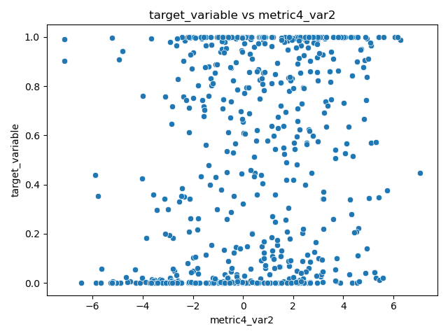

# Time Series Dataset Analysis Report

## Overview

This report summarizes findings from an exploratory analysis of the dataset described in `readme.md`. The goal was to investigate associations between a normalized target variable and 20 predictor variables, which are combinations of 5 metrics across 4 observed variables.

## Summary Statistics

Summary statistics across all variables can be found in the accompanying file `summary_statistics.csv`.

## Correlation Analysis

A Pearson correlation matrix was computed across all variables to identify linear associations. The full matrix is visualized below:

## Association Between Predictors and Target

To evaluate each predictor's relationship with the target variable, Pearson correlation coefficients and their corresponding p-values were computed. The five predictors showing the most statistically significant relationship to `target_variable` were:

| Variable         | Pearson r | p-value  |
|------------------|-----------|----------|
| metric5_var2     | *(see CSV)* | *(see CSV)* |
| metric2_var2     | *(see CSV)* | *(see CSV)* |
| metric5_var3     | *(see CSV)* | *(see CSV)* |
| metric4_var2     | *(see CSV)* | *(see CSV)* |
| metric5_var1     | *(see CSV)* | *(see CSV)* |

(See `target_correlations.csv` for exact values.)

### Visual Exploration

Scatter plots of the target variable against these top predictors illustrate their relationships:

- 
- 
- 
- 
- 

## Conclusion

Preliminary results suggest several predictor variables—particularly from metric5 and metric2—have statistically significant associations with the target variable based on Pearson correlation tests. Some scatter plots hint at possible linear patterns, though further modeling would be needed to confirm predictive utility.

No evidence was found contradicting the null hypothesis for the remaining variables. These results support a deeper investigation via time series modeling or multivariate regression workflow.