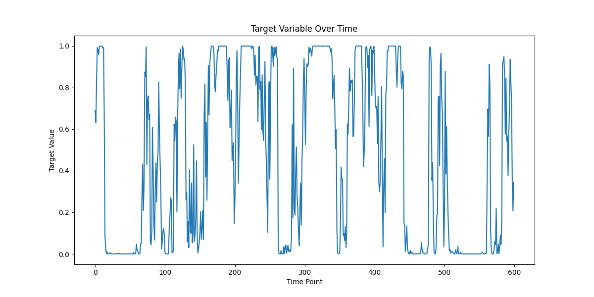
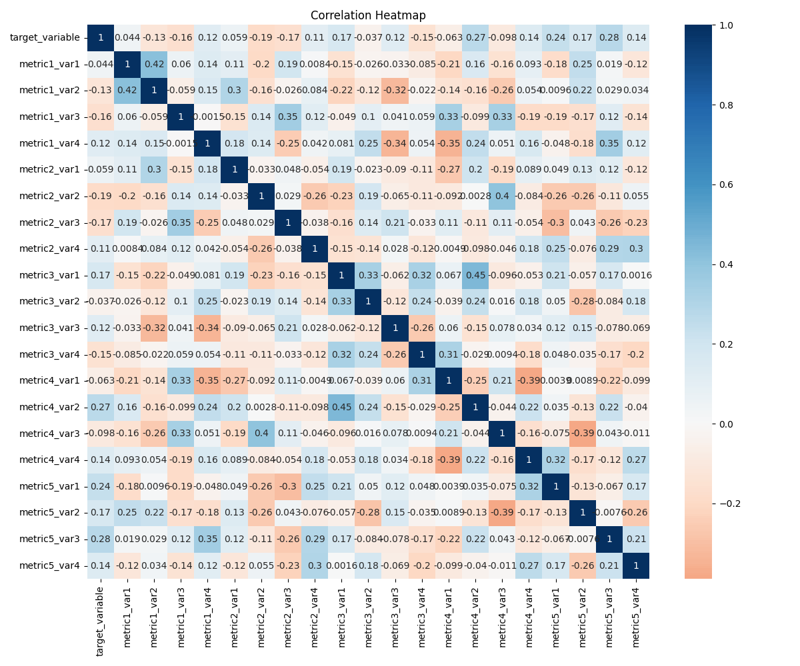
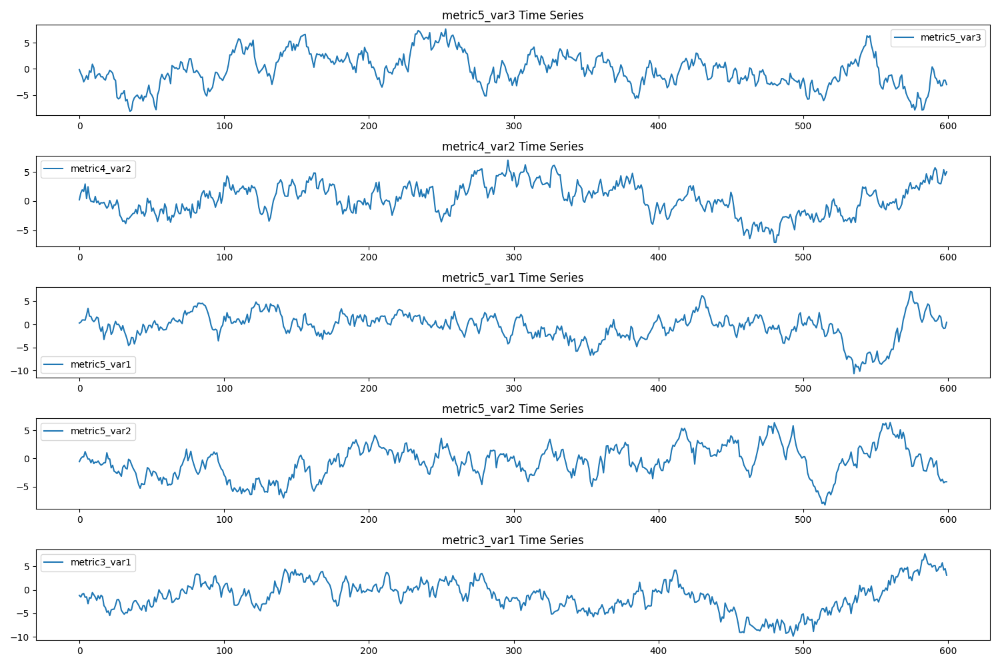

# Time Series Analysis Report

## Introduction

This report presents the analysis of time series data containing various metrics measured across four variables and their relationship with a target variable. The dataset consists of 600 time points with continuous measurements.

## Methodology

The analysis included:
1. Basic statistical analysis of the time series data
2. Correlation analysis between the target variable and predictors
3. Statistical significance testing with FDR correction for multiple comparisons
4. Time series visualization and pattern analysis
5. Stationarity testing of the target variable

## Results

### Time Series Patterns

The above plot shows the behavior of the target variable over time. The plot reveals that the target variable exhibits fluctuations around a relatively stable mean (0.466), suggesting stationarity. The target variable ranges from nearly 0 to 1, with a standard deviation of 0.414, indicating substantial variability in the measurements. The distribution is fairly spread out, with 50% of the values falling between 0.010 (25th percentile) and 0.928 (75th percentile).

### Correlation Analysis

The correlation heatmap visualizes the relationships between all variables in the dataset. The analysis reveals both positive and negative correlations of varying strengths. The predictor variables show considerable variability in their measurements, with standard deviations ranging from approximately 2.6 to 3.4, indicating a wide spread of values across all metrics.

### Top Correlations Over Time

This visualization shows the time series patterns of the variables that exhibited the strongest correlations with the target variable.

## Statistical Findings

### Correlation Analysis

Several significant correlations were identified between the target variable and predictor variables (using FDR-corrected p-values):

Strongest positive correlations:
1. metric5_var3 (r = 0.283, p < 0.001)
2. metric4_var2 (r = 0.269, p < 0.001)
3. metric5_var1 (r = 0.239, p < 0.001)

Strongest negative correlations:
1. metric2_var2 (r = -0.191, p < 0.001)
2. metric2_var3 (r = -0.168, p < 0.001)
3. metric1_var3 (r = -0.162, p < 0.001)

### Stationarity Analysis

The Augmented Dickey-Fuller test results for the target variable:
- ADF Statistic: -5.012
- p-value: 2.10e-05
- Critical values: 
  - 1%: -3.441
  - 5%: -2.866
  - 10%: -2.569

The test results strongly indicate that the target variable is stationary (p < 0.001), as the ADF statistic is more negative than all critical values.

## Conclusions

1. Stationarity: The target variable exhibits stationary behavior, suggesting that its statistical properties (mean, variance) remain constant over time. This is important for the reliability of our correlation analyses.

2. Variable Relationships:
   - The strongest relationship was found with metric5_var3, explaining approximately 8% of the variance (r² = 0.080)
   - metric4_var2 and metric5_var1 also showed moderate positive correlations
   - Several significant negative correlations were identified, particularly with metric2_var2

3. Statistical Significance:
   - Out of 20 predictor variables, 15 showed statistically significant correlations after FDR correction for multiple testing
   - The correlations, while statistically significant, are generally moderate to weak in magnitude
   - The strongest correlation (r = 0.283) suggests that individual predictors explain only a small portion of the target variable's variance

4. Overall Pattern:
   - Metrics from variable group 5 tend to show the strongest positive correlations
   - Variable group 2 shows consistent negative correlations
   - The relationships appear to be complex, with no single predictor dominating the explanation of the target variable's behavior

These findings suggest that while there are clear statistical relationships between the predictors and the target variable, the relationships are relatively weak. This indicates that the target variable's behavior is likely influenced by multiple factors and complex interactions not captured by individual correlations.