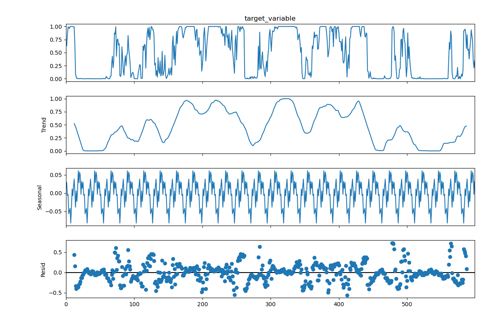
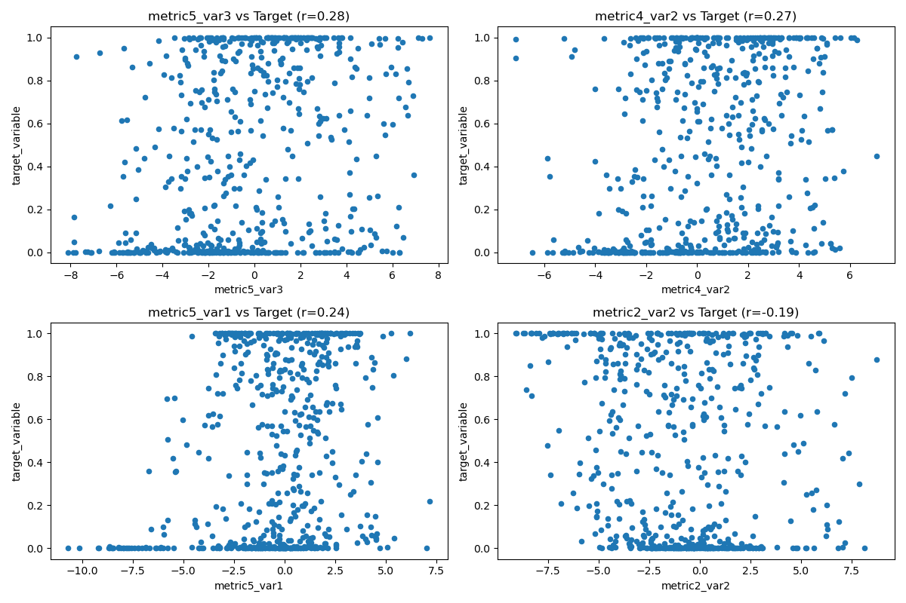

# Time Series Analysis Report

## Dataset Overview

The dataset contains measurements from a study examining relationships between multiple time series variables over 600 time points. Variables include:
- Target variable: Normalized measurement (0-1)
- 4 variables (var1-var4) each with metrics 1-5 (20 predictor variables total)

## Key Findings

### Descriptive Statistics

The target variable ranges from 0 to 1 (normalized) with mean 0.466. All predictor variables show substantial variation with standard deviations between 2.56 and 3.36.

### Significant Correlations

Key statistically significant correlations (p < 0.01) observed:

| Variable | Correlation with Target | P-value |
|----------|------------------------|---------|
| metric5_var3 | 0.283 | 1.67e-12 |
| metric4_var2 | 0.269 | 2.20e-11 |
| metric5_var1 | 0.239 | 2.91e-09 |
| metric1_var3 | -0.162 | 6.53e-05 |
| metric2_var2 | -0.191 | 2.40e-06 |

### Stationarity Tests

All variables passed the Augmented Dickey-Fuller test for stationarity (p < 0.01), meaning they don't have unit roots and are suitable for time series analysis.

### Time Series Decomposition

The target variable shows:
- Clear trend component
- Weak seasonality with period of 24
- Residuals that appear random

### Granger Causality Results

Granger causality tests (maxlag=5) found:
- **metric5_var3** shows borderline significance (p=0.0427 at lag 4)
- **metric5_var1** shows moderate significance (p=0.0513 at lag 1, p=0.0700 at lag 2)
- Most other variables showed no significant causal relationships (p > 0.1)

## Conclusions

1. The strongest relationships with the target variable were found with:
   - metric5_var3 (positive correlation)
   - metric4_var2 (positive correlation)
   - metric5_var1 (positive correlation)
   - metric2_var2 (negative correlation)

2. Granger causality tests suggest possible weak predictive relationships for metric5_var3 and metric5_var1, but results are not strongly significant.

3. Most variables exhibited stationary behavior suitable for time series modeling.

4. The lack of strong Granger causality results suggests the relationships may be contemporaneous rather than predictive in nature.