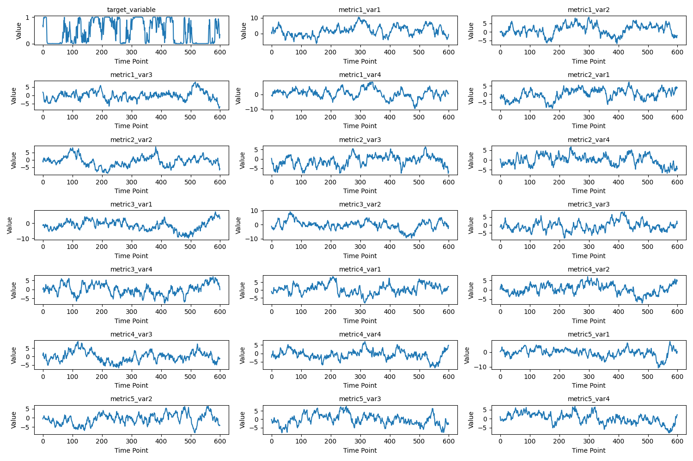
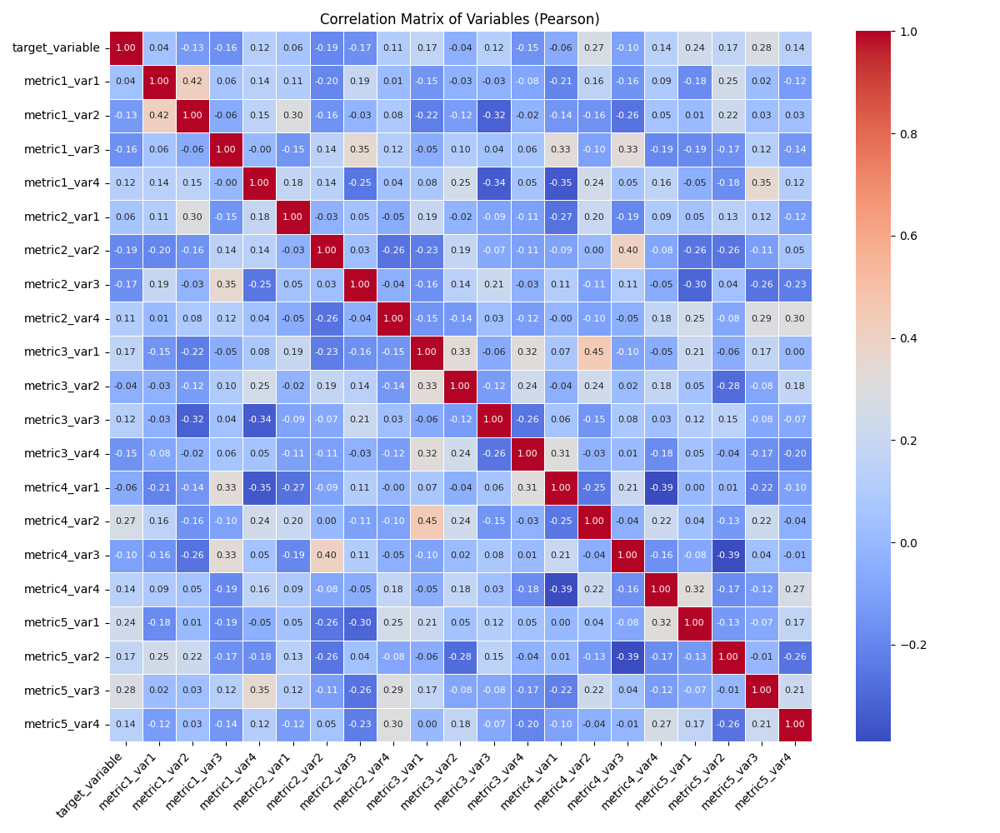
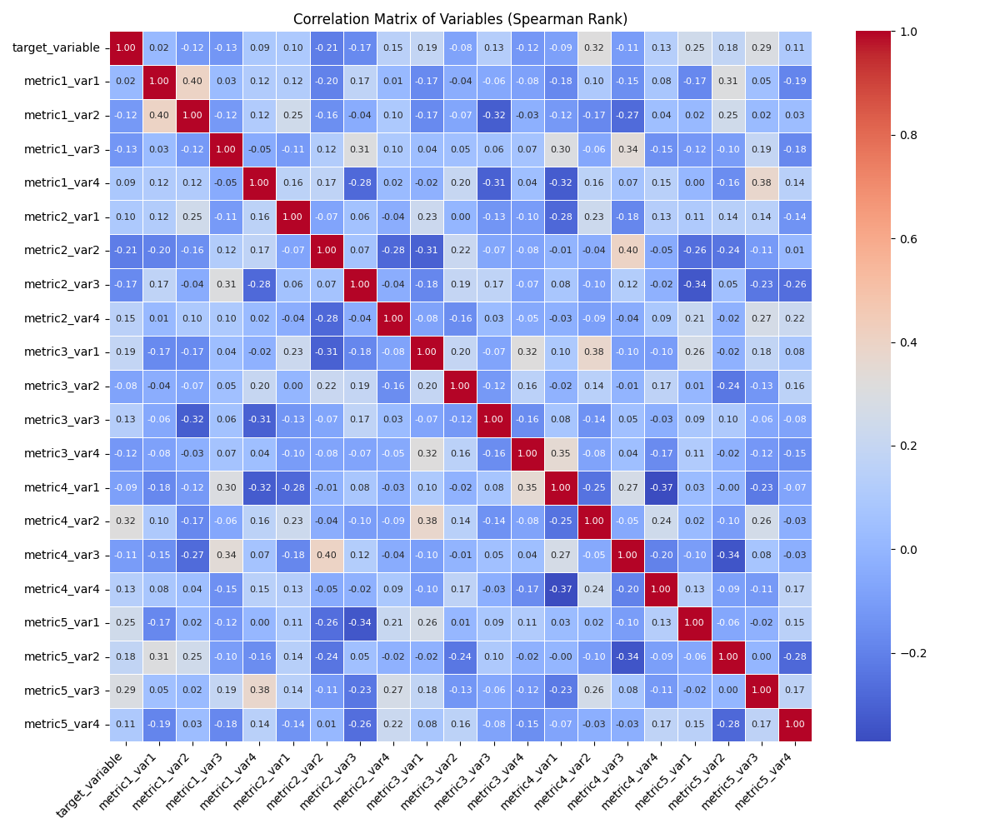

# Time Series Dataset Exploration Report

## 1. Introduction

This report summarizes the exploratory data analysis (EDA) and statistical findings from the provided time series dataset. The dataset, described in `readme.md`, contains a `target_variable` and 20 predictor variables (metrics 1-5 across vars 1-4). The primary goal was to investigate the association between the target variable and these predictor variables over 600 time points.

The analysis was performed using a Python script (`explore_data.py`) which handled data loading, descriptive statistics, visualization, correlation analysis, and Granger causality tests.

## 2. Dataset Overview

The dataset consists of 600 observations (time points) and 21 variables (1 target, 20 predictors). All variables are continuous numerical measurements.

## 3. Exploratory Data Analysis

### 3.1. Time Series Visualization

All variables were plotted over time to observe their individual trends and patterns.

*Figure 1: Time series plots of the target variable and all predictor variables.*

### 3.2. Correlation Analysis

To understand the linear and monotonic relationships between variables, correlation matrices were computed using both Pearson (for linear) and Spearman (for monotonic) correlation coefficients.

**Pearson Correlation Heatmap:**

*Figure 2: Pearson correlation matrix. Values closer to +1 or -1 indicate stronger linear correlation. P-values for target variable correlations are detailed below.*

**Spearman Rank Correlation Heatmap:**

*Figure 3: Spearman rank correlation matrix. This assesses monotonic relationships.*

**Detailed Correlation with `target_variable`:**

The script computed Pearson and Spearman correlations between `target_variable` and each predictor. Key findings (refer to `correlation_results.csv` for full details):

Statistically significant correlations (p < 0.05) were observed for many predictors. Here are some of the strongest correlations with `target_variable`:

*   **`metric5_var3`**:
    *   Pearson: 0.2829 (p-value: 1.673e-12)
    *   Spearman: 0.2948 (p-value: 1.695e-13)
*   **`metric4_var2`**:
    *   Pearson: 0.2687 (p-value: 2.195e-11)
    *   Spearman: 0.3157 (p-value: 2.356e-15)
*   **`metric5_var1`**:
    *   Pearson: 0.2393 (p-value: 2.912e-09)
    *   Spearman: 0.2459 (p-value: 1.034e-09)
*   **`metric2_var2`**:
    *   Pearson: -0.1912 (p-value: 2.4e-06)
    *   Spearman: -0.2140 (p-value: 1.215e-07)
*   **`metric3_var1`**:
    *   Pearson: 0.1669 (p-value: 3.973e-05)
    *   Spearman: 0.1872 (p-value: 3.904e-06)

Most correlations, while statistically significant due to the sample size, are weak to moderate in strength (typically |r| &lt; 0.3). `metric4_var2` shows the highest Spearman correlation (0.3157).

## 4. Temporal Association: Granger Causality

Granger causality tests were performed to explore if past values of predictor variables could help predict future values of the `target_variable`, and vice-versa. Tests were run with up to 5 lags for the top 3 predictors (based on Pearson correlation magnitude with the target).

*It's important to note that Granger causality indicates predictive likelihood, not true causation, and assumes data stationarity (which was not explicitly tested for brevity in the script, potentially affecting the validity of these specific Granger results).*

**Results:**

1.  **`metric5_var3` and `target_variable`**:
    *   `metric5_var3` Granger-causes `target_variable`: Minimum p-value = 0.1201 (Not significant at α=0.05)
    *   `target_variable` Granger-causes `metric5_var3`: Minimum p-value = 0.1551 (Not significant at α=0.05)

2.  **`metric4_var2` and `target_variable`**:
    *   `metric4_var2` Granger-causes `target_variable`: **Minimum p-value = 0.006992 (Significant at α=0.01)**
    *   `target_variable` Granger-causes `metric4_var2`: Minimum p-value = 0.5580 (Not significant at α=0.05)
    *   *This suggests that past values of `metric4_var2` may have predictive power for `target_variable`.*

3.  **`metric5_var1` and `target_variable`**:
    *   `metric5_var1` Granger-causes `target_variable`: Minimum p-value = 0.4198 (Not significant at α=0.05)
    *   `target_variable` Granger-causes `metric5_var1`: Minimum p-value = 0.09051 (Not significant at α=0.05, borderline for α=0.10)

## 5. Conclusion

The analysis of the time series dataset reveals several statistically significant associations between predictor variables and the `target_variable`.

*   **Correlation**: Many predictors exhibit statistically significant (p < 0.05) Pearson and Spearman correlations with the `target_variable`. However, the magnitudes of these correlations are generally weak to moderate (-0.2 to 0.3 approximately). The variables `metric5_var3`, `metric4_var2`, and `metric5_var1` showed the strongest (though still moderate) positive correlations, while `metric2_var2` showed the strongest negative correlation.

*   **Temporal Dynamics (Granger Causality)**:
    *   There is evidence suggesting that past values of `metric4_var2` Granger-cause (i.e., have predictive value for) the `target_variable` (min p-value = 0.007).
    *   No significant evidence was found for `metric5_var3` or `metric5_var1` Granger-causing the `target_variable` at the tested lags.
    *   There was no strong evidence of `target_variable` Granger-causing any of the top 3 tested predictors.

**Overall, there *is* an association between the target variable and several predictor variables over time.** This is supported by multiple significant correlations and a significant Granger causality result for `metric4_var2` influencing `target_variable`. The strength of these individual relationships, however, appears to be mostly weak to moderate.

Further investigation could involve more rigorous time series modeling (e.g., VAR, VECM, checking for stationarity, cointegration) to better understand the complex dynamics and combined predictive power of these variables.