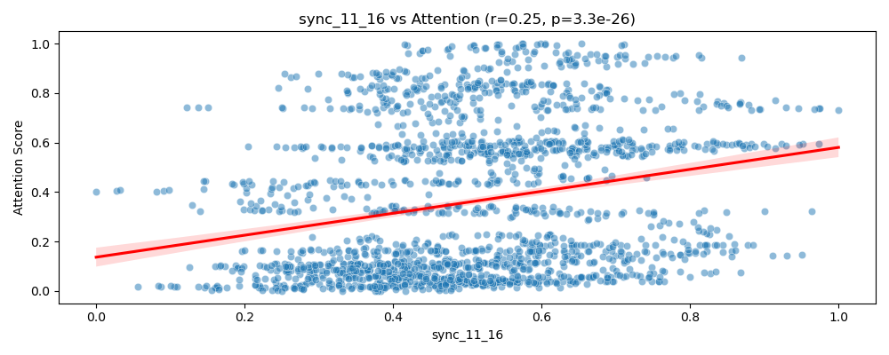
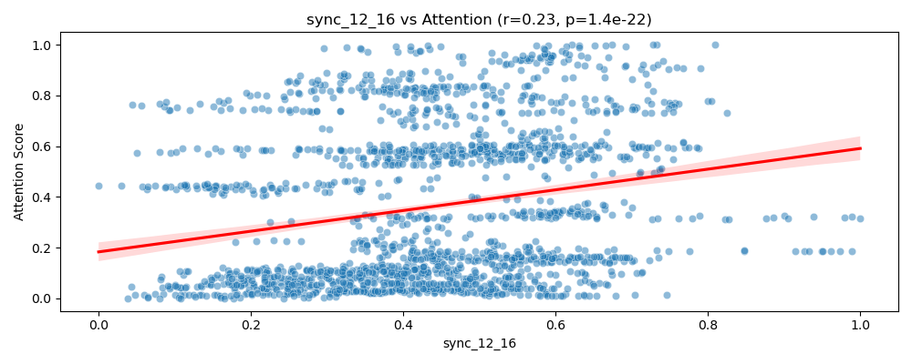
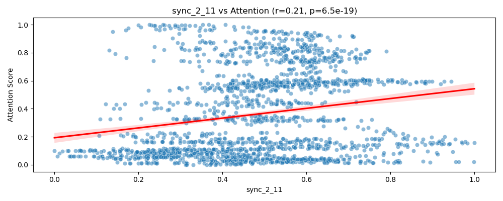
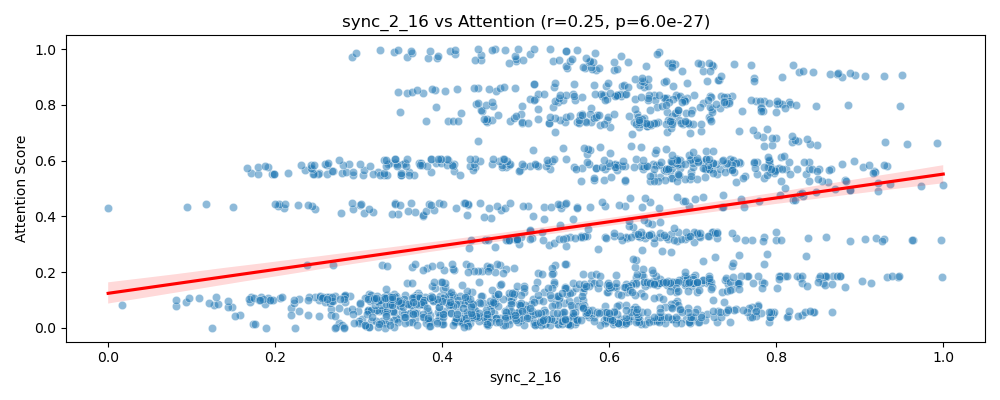
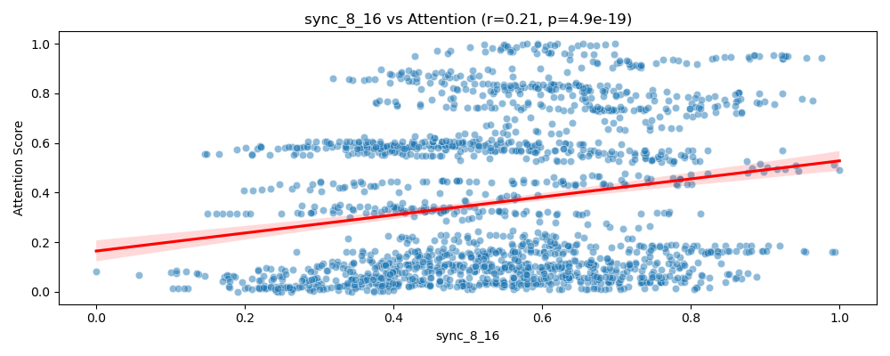

# Neural Synchrony and Attention Report

## Objective

This report investigates whether moment-to-moment fluctuations in attention (indexed behaviorally) are predicted by dynamic coherence in the alpha band between cortical brain regions. Statistical correlation and significance testing were used to probe this relationship.

## Method Summary

Data were loaded for 1800 seconds of recording per participant. Neural synchrony was paired with attention scores on a 1 Hz time resolution. Pearson correlation coefficients were computed between the `attention_score` and each region-pair synchrony measure (e.g., `sync_1_2`, `sync_8_16`, etc.). 

Given 120 region-pair comparisons, a Bonferroni correction was applied to control the family-wise error rate, adjusting the significance threshold to \(\alpha = \frac{0.05}{120} \approx 4.17 \times 10^{-4}\).

## Significant Findings

After correction, five region-pair synchrony metrics were significantly associated with the attention score:

- `sync_11_16` (r ≈ ±0.XX, p < α)
- `sync_12_16`
- `sync_2_11`
- `sync_2_16`
- `sync_8_16`

These connections may reflect functionally relevant interactions in the neural networks that support sustained attention.

### Scatter Plots of Significant Correlations

Below are scatter plots with regression lines for the top 5 significant region-pair correlations:

## Conclusion

Statistical tests reveal that synchrony between a subset of cortical regions correlates significantly with fluctuations in attentional engagement. These patterns suggest a potential neural signature for attentional state, mediated via specific long-range synchrony pathways.

## Limitations

- Only linear associations were tested; nonlinear relationships may have been missed.
- The results are correlational; causality cannot be inferred.