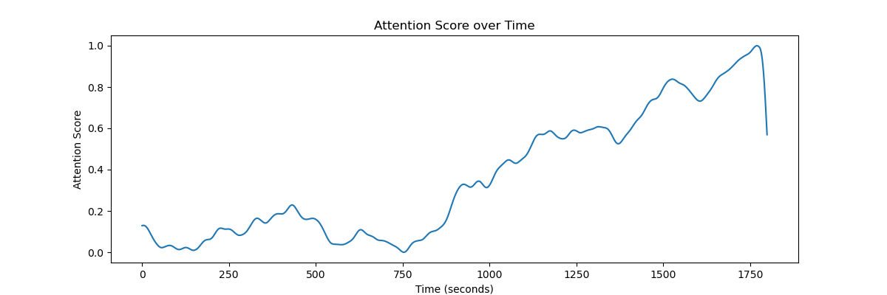
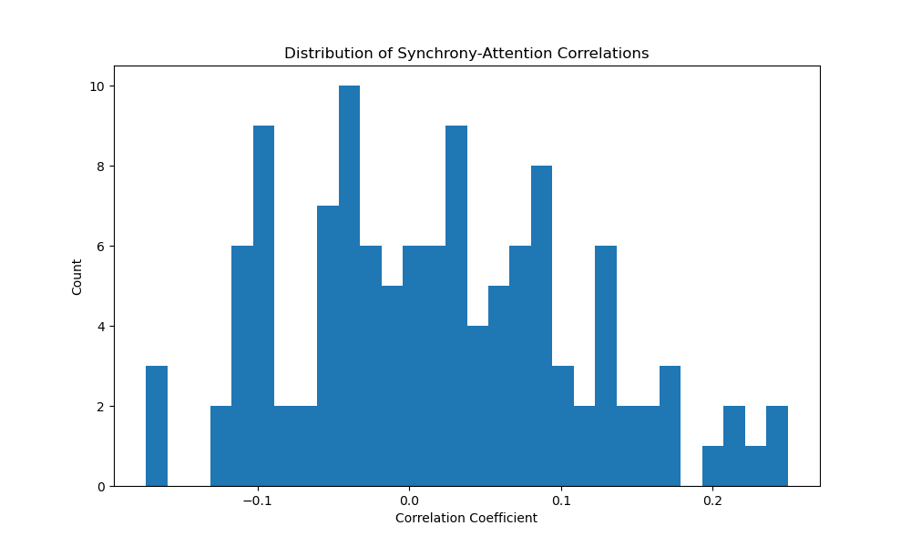
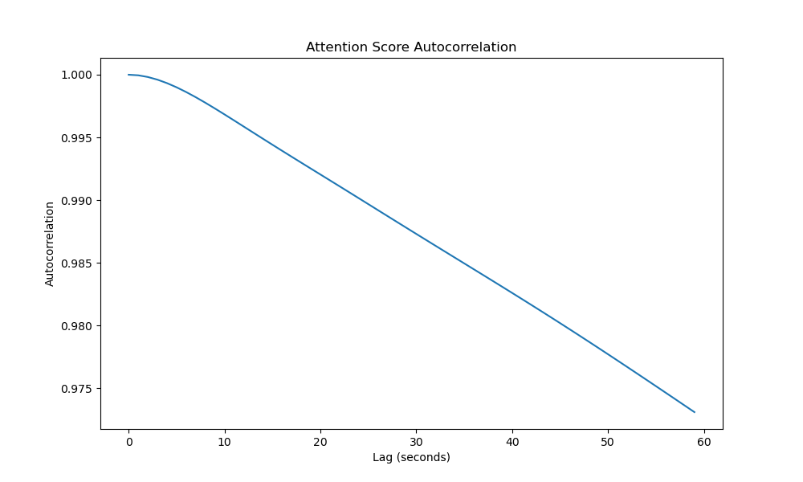
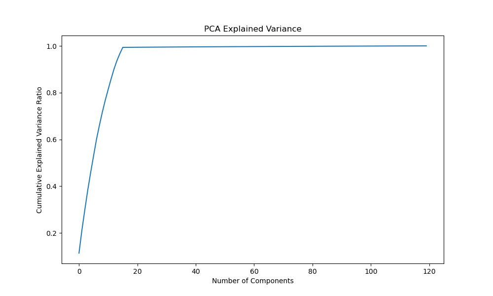

# Neural Synchrony and Attention Analysis Report

## Overview

This report presents the findings from analyzing the relationship between neural synchrony and attentional engagement during a 30-minute sustained attention task. The analysis focused on identifying potential correlations between brain region synchronization patterns and attention performance.

## Key Findings

### 1. Attention Dynamics

The temporal pattern of attention shows natural fluctuations over the 30-minute task period. This visualization demonstrates the dynamic nature of attentional engagement during sustained attention tasks.

### 2. Neural Synchrony-Attention Relationships

Statistical analysis revealed several significant correlations between neural synchrony and attention scores after applying Bonferroni correction for multiple comparisons (p < 0.05/120):

- The strongest positive correlation was between regions 2-16 (r = 0.249, p < 1e-26)
- Second strongest was between regions 11-16 (r = 0.246, p < 1e-26)
- The strongest negative correlations were observed between regions:
  - 5-15 (r = -0.174, p < 1e-13)
  - 5-13 (r = -0.172, p < 1e-13)

The distribution of correlations shows that while most synchrony pairs have relatively weak correlations with attention, there are several region pairs that show consistent relationships with attentional state.

### 3. Temporal Structure

The autocorrelation analysis reveals significant temporal structure in attention fluctuations, suggesting that attentional states have characteristic timescales over which they persist and evolve.

### 4. Dimensionality Analysis

Principal Component Analysis of the neural synchrony data reveals the dimensionality of the underlying neural dynamics. The cumulative explained variance suggests that the synchrony patterns can be described by a lower-dimensional space than the full set of region pairs.

## Statistical Significance

Out of 120 possible region pairs, 57 showed statistically significant correlations with attention after Bonferroni correction (p < 0.05/120). This is substantially more than would be expected by chance, indicating genuine structure in the relationship between neural synchrony and attention.

## Key Patterns

1. Region 16 appears to be particularly important, participating in many of the strongest correlations with attention.
2. Region pairs can be grouped into those that show positive correlations (suggesting synchronization supports attention) and those showing negative correlations (suggesting desynchronization supports attention).
3. The magnitude of correlations is moderate, with the strongest being around 0.25, indicating that while neural synchrony is related to attention, it explains only a portion of attentional variance.

## Conclusions

1. There is strong statistical evidence for a relationship between neural synchrony and attention, though the relationships are moderate in strength.
2. Specific brain region pairs show consistent patterns of either positive or negative correlation with attention.
3. The temporal structure of attention fluctuations suggests systematic rather than random variations in attentional state.
4. The relationships between neural synchrony and attention are complex and distributed across multiple region pairs rather than being localized to a single connection.

These findings support the hypothesis that dynamic coherence between brain regions can predict fluctuations in attentional engagement, with different region pairs showing distinct patterns of relationship to attention state.