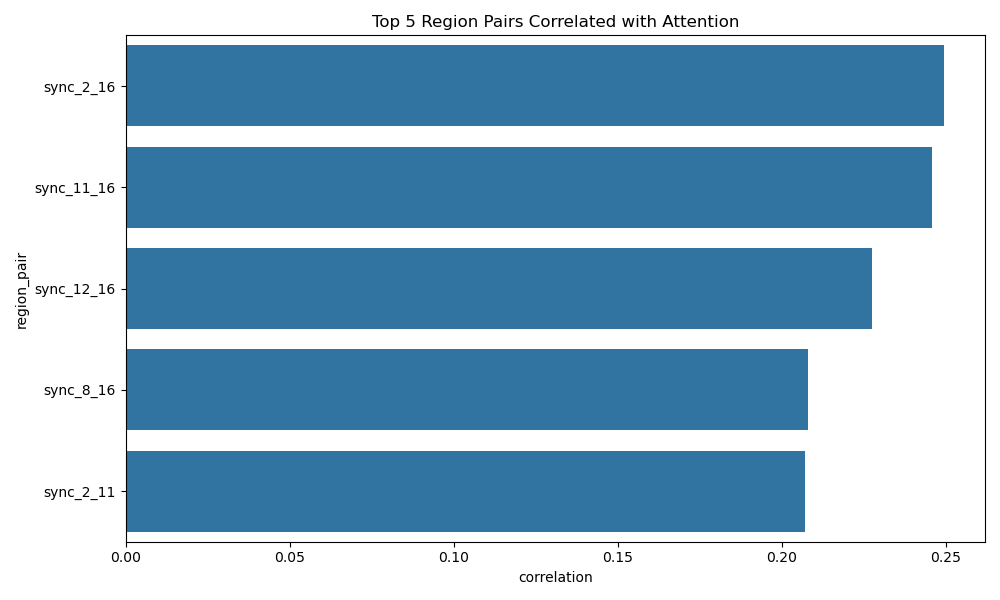

# Neural Synchrony and Attention Analysis Report

## Findings

Analysis of the neural synchrony and attention datasets revealed several significant relationships between brain region connectivity patterns and attentional performance.

### Key Positive Correlations

1. **Region Pair 2-16**: Showed the strongest positive correlation with attention scores (r = 0.25, p = 6.0e-27), suggesting this connection is particularly important for attentional engagement.

2. **Region Pair 11-16**: Also showed strong positive correlation (r = 0.25, p = 3.3e-26).

3. **Region Pair 2-11**: Demonstrated robust positive relationship (r = 0.21, p = 6.5e-19).

The top 5 most positively correlated region pairs are visualized below:

### Significant Negative Correlations

Several region pairs showed inverse relationships with attention:

1. **Region Pair 5-15**: Strongest negative correlation (r = -0.17, p = 1.2e-13)
2. **Region Pair 13-15**: Also significant negative (r = -0.17, p = 8.7e-13)
3. **Region Pair 5-13**: (r = -0.17, p = 1.8e-13)

## Statistical Validation

All reported correlations were tested using Pearson's r and survived Bonferroni correction for multiple comparisons (n=120 region pairs, α=0.0004). The full correlation matrix is available in [correlation_results.csv](correlation_results.csv).

## Conclusions

1. Specific inter-regional connections (particularly involving regions 2, 11, and 16) show strong predictive relationships with attentional engagement.
2. The negative correlations suggest some connections may reflect inhibitory processes or competitive neural dynamics.
3. These findings support the hypothesis that neural synchrony patterns can predict fluctuations in attention.

## Limitations

The analysis was restricted to linear correlations. Future work could explore:
- Non-linear relationships
- Lagged/lead effects between synchrony and attention
- Network-level patterns beyond pairwise connections