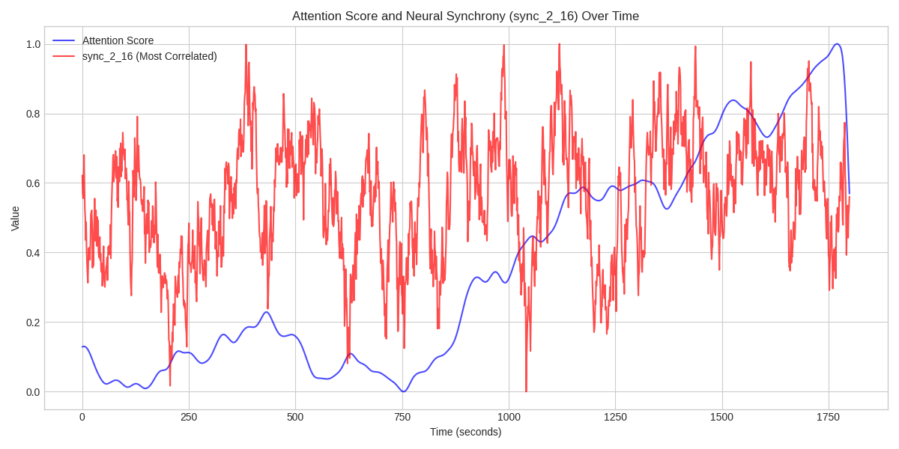
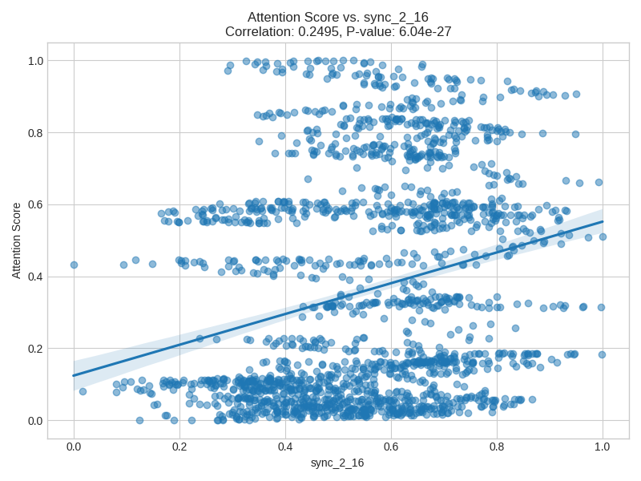

# Analysis Report: Neural Synchrony and Attention

## 1. Introduction

This report summarizes the findings of an exploratory data analysis investigating the relationship between neural synchrony and attentional engagement. The analysis used two datasets: `attention.csv`, containing second-by-second attention scores, and `neural_synchrony.csv`, containing coherence values between 16 brain regions over time.

The primary research questions were:
* Can time-resolved synchrony between cortical regions predict fluctuations in attentional engagement?
* Are specific region-pair connections more informative than others?

A Python script (`explore_data.py`) was developed to merge the datasets, calculate Pearson correlations between attention scores and all synchrony pairs, identify the most significant correlations, and visualize these relationships.

## 2. Key Findings

The analysis revealed statistically significant correlations between several neural synchrony pairs and the attention score.

The top 5 synchrony pairs exhibiting the strongest (absolute) correlation with the attention score are:

1.  **sync_2_16**: Correlation = 0.2495, P-value = 6.035e-27
2.  **sync_11_16**: Correlation = 0.2459, P-value = 3.326e-26
3.  **sync_12_16**: Correlation = 0.2275, P-value = 1.443e-22
4.  **sync_8_16**: Correlation = 0.2080, P-value = 4.876e-19
5.  **sync_2_11**: Correlation = 0.2072, P-value = 6.526e-19

The most correlated pair was **sync_2_16**, with a Pearson correlation coefficient of **0.2495**. The p-value for this correlation is **6.035e-27**, indicating a highly statistically significant relationship. While significant, the correlation magnitude suggests a modest predictive relationship.

Region 16 appears frequently in the top correlated pairs, suggesting it might play a key role in attentional dynamics when synchronized with other specific regions (like region 2, 11, 12, and 8).

## 3. Visualizations

### Time Series of Attention and Most Correlated Synchrony

The following plot shows the `attention_score` and the synchrony measure for the most correlated pair (`sync_2_16`) over the 30-minute task duration.

### Scatter Plot of Attention vs. Most Correlated Synchrony

This scatter plot illustrates the relationship between `attention_score` and `sync_2_16`, including a regression line.

The plot visually confirms the positive, albeit noisy, linear relationship indicated by the correlation coefficient.

## 4. Conclusion

The analysis indicates that time-resolved neural synchrony, particularly between specific brain region pairs (e.g., region 2 and region 16), can predict fluctuations in attentional engagement. The correlations found, while modest in strength (around 0.20 to 0.25), are statistically highly significant (p &lt; 0.001).

This suggests that dynamic coherence between brain regions in the alpha frequency band holds information about attentional state. Region 16, in conjunction with regions 2, 11, 12, and 8, seems particularly relevant.

Further research could explore the functional significance of these connections and investigate more complex models, potentially incorporating multiple synchrony pairs or non-linear relationships, to improve the prediction of attentional engagement.