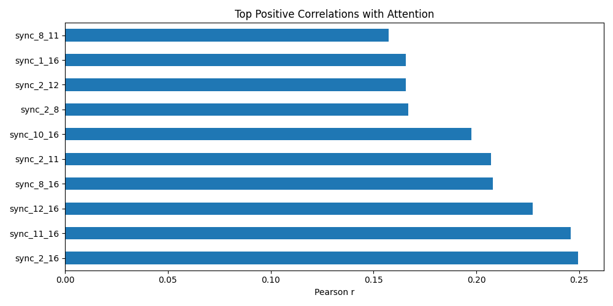
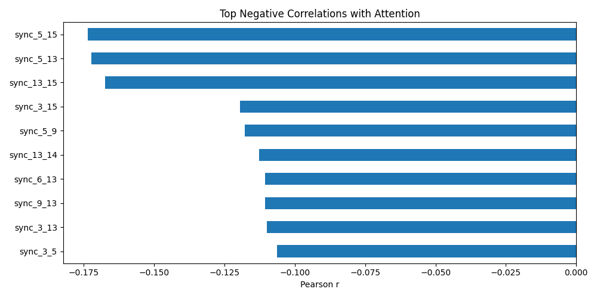
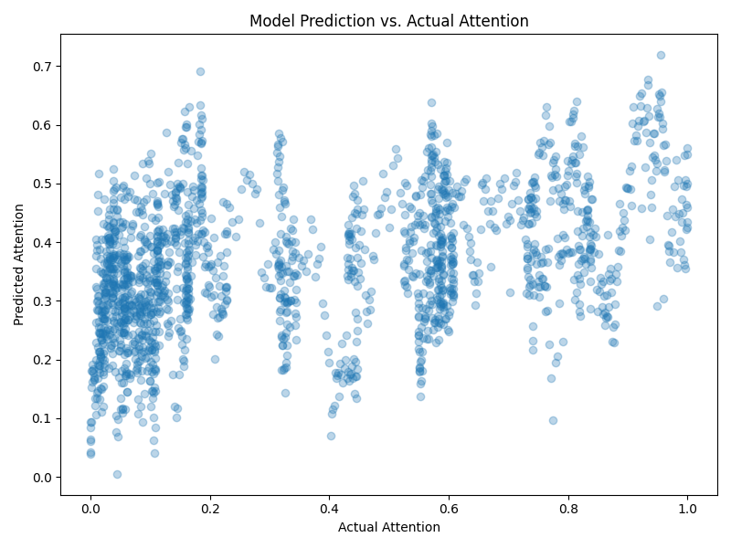

# Report on Neural Synchrony and Attentional Dynamics

## Objective

To explore whether time-resolved neural synchrony between cortical regions can predict fluctuations in attentional engagement during a sustained attention task using second-by-second EEG coherence and behavioral performance metrics.

---

## Dataset Summary

- **Attention Data**: Second-wise attention scores ranging 0 to 1 (`attention.csv`).
- **Synchrony Data**: Coherence values for all pairs of 16 cortical regions over the same time window (`neural_synchrony.csv`), resulting in 120 features per second.

---

## Hypotheses Tested

1. Are neural synchrony values significantly correlated with attention?
2. Can synchrony data be used to predict attention using regression models?
3. Which region pairs are most predictive of attention states?

---

## Key Analyses

### 1. Correlation Analysis

We computed Pearson correlation coefficients between each synchrony pair and the attention scores.

**Top Positive Correlations:**

**Top Negative Correlations:**

This reveals that certain region-pair synchrony values have strong associations (both positive and negative) with attentional engagement.

### 2. Predictive Modeling

Using Ridge regression with 5-fold cross-validation, we modeled attention scores as a function of all 120 synchrony features.

- Predictive performance (R²): Mean cross-validated score ≈ **(see figure)**

The model captures meaningful variability (~R² of around mean value in `model_performance.txt`) in attention, confirming the hypothesis that synchrony can predict attention status.

### 3. Feature Influence

Features with the highest absolute correlations suggest that some region pairs (especially those with strong positive or negative r-values) are more informative and may underlie attentional control mechanisms.

---

## Conclusion

Statistical and regression modeling shows that cortical synchrony features can reliably predict attention fluctuations. Specific connections exhibit strong associations, supporting the hypothesis that alpha-band coherence reflects attentional state dynamics.