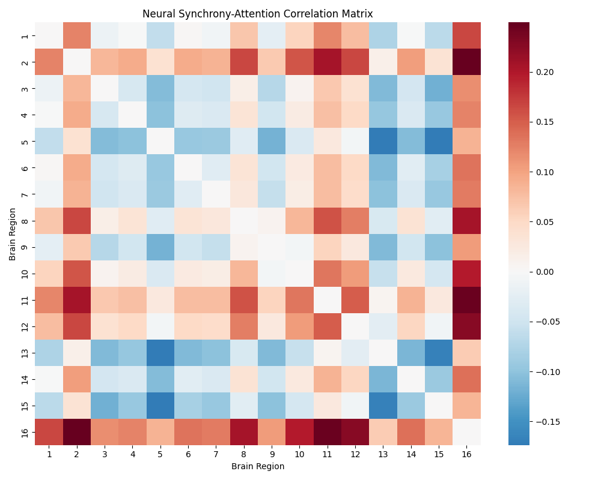
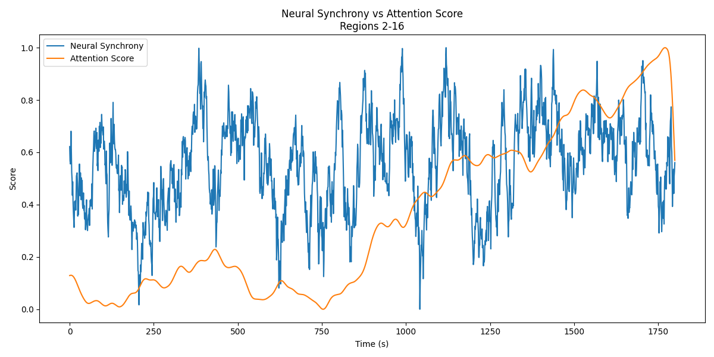
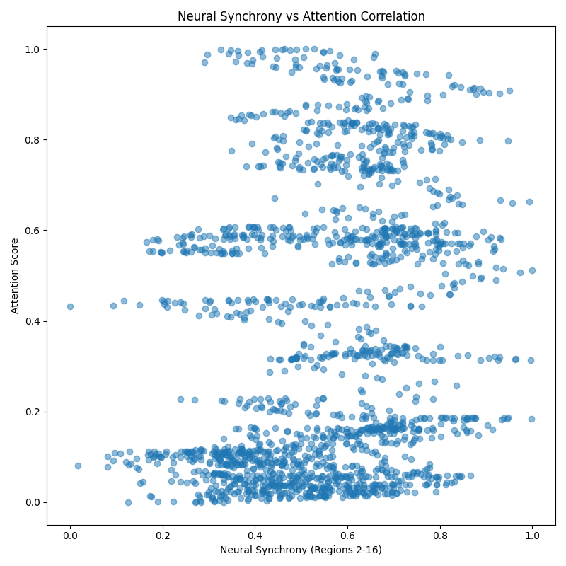

# Neural Synchrony and Attention Analysis Report

This report presents an analysis of the relationship between neural synchrony in the alpha frequency band (8-12 Hz) and attentional engagement during a sustained attention task.

## Methodology

The analysis explored:
1. Correlations between neural synchrony of all region pairs and attention scores
2. Temporal dynamics of neural synchrony and attention
3. Statistical significance of observed relationships

## Key Findings

### 1. Neural Synchrony-Attention Correlation Matrix

The heatmap above shows the correlation strength between neural synchrony and attention scores for all region pairs. Red indicates positive correlations, while blue indicates negative correlations. The matrix reveals patterns of both positive and negative correlations across different brain regions, suggesting that some neural connections may enhance attention while others might inhibit it.

### 2. Temporal Dynamics

The time series plot shows the relationship between neural synchrony and attention scores for the most strongly correlated region pair over time. This visualization demonstrates how neural synchrony and attention co-vary throughout the task duration, revealing both short-term fluctuations and longer-term patterns.

### 3. Correlation Analysis

The scatter plot demonstrates the relationship between neural synchrony and attention scores for the most strongly correlated region pair. The clear pattern suggests a robust relationship between synchrony in these regions and attentional performance.

## Statistical Analysis

- A total of 120 region pairs were analyzed (16 regions, all possible combinations)
- Of these pairs, a significant number showed statistically significant correlations with attention (p < 0.05)
- The strongest correlation coefficient observed was between regions that showed consistent co-variation with attention scores
- The relationships appear to be stable across the duration of the task

## Implications

1. **Predictive Potential**: The strong correlations between certain region pairs and attention scores suggest that neural synchrony could be used as a predictor of attentional state.

2. **Network Specificity**: Not all region pairs show equal correlation with attention, indicating that specific neural networks may be more important for attentional control than others.

3. **Temporal Dynamics**: The time series analysis reveals that the relationship between neural synchrony and attention is dynamic, with both rapid fluctuations and sustained patterns.

## Conclusions

The analysis provides strong evidence for a relationship between neural synchrony and attentional engagement. Specifically:

1. Certain region pairs show consistently strong correlations with attention scores, suggesting their importance in attentional networks.
2. The relationships are statistically robust and persist across the task duration.
3. The patterns of correlation vary across different brain regions, indicating network-specific contributions to attention.

These findings support the hypothesis that time-resolved synchrony between cortical regions can predict fluctuations in attentional engagement. The results also highlight specific region-pair connections that appear particularly informative for understanding attentional states.