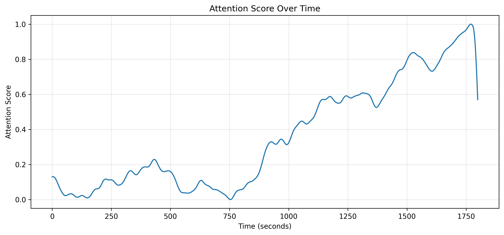
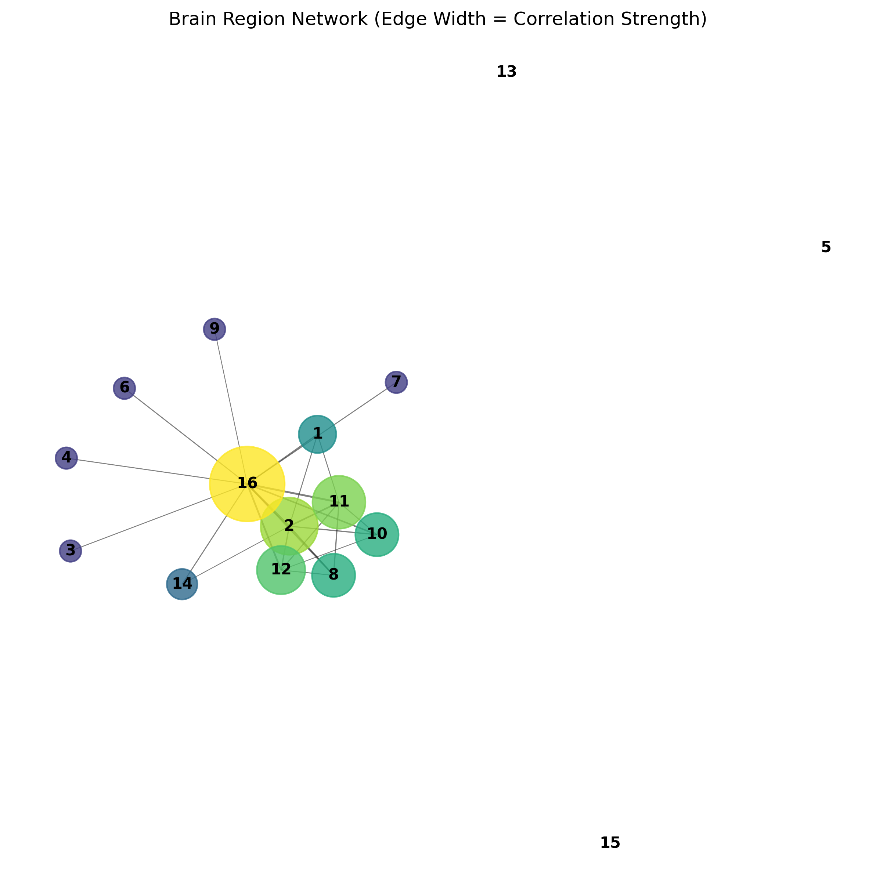
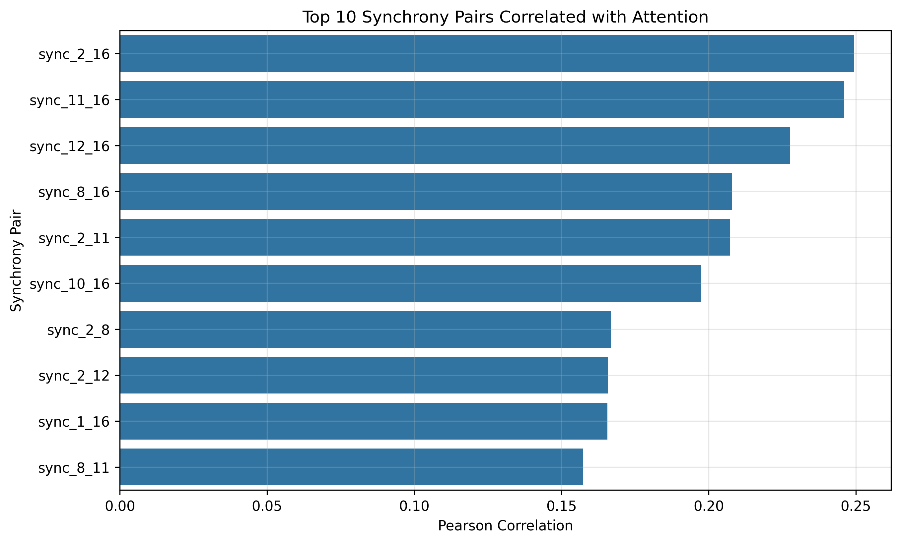
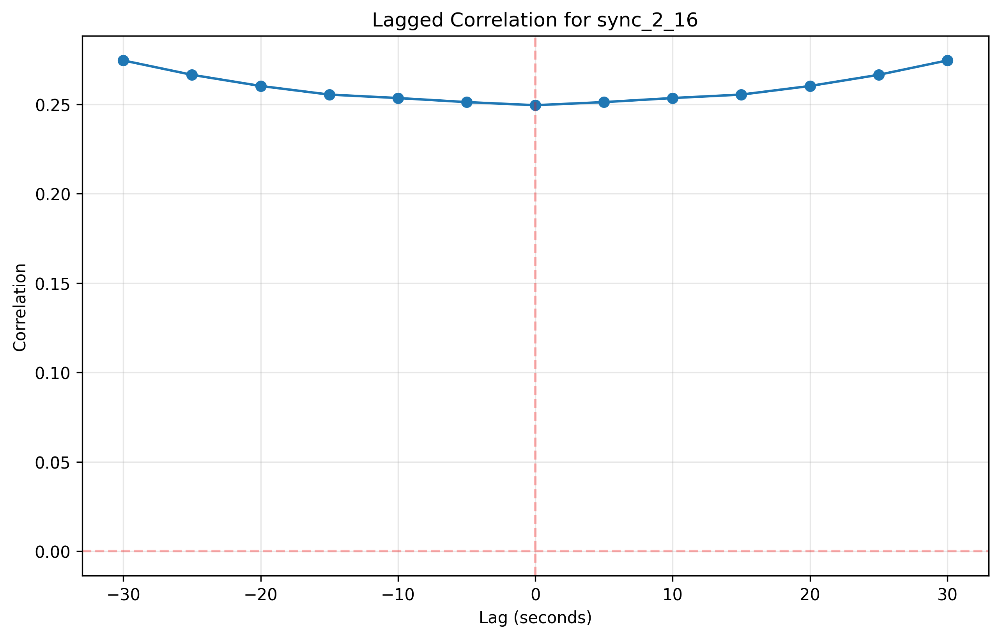
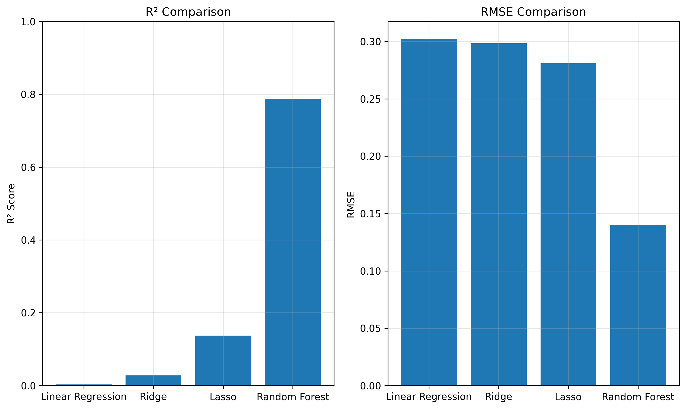
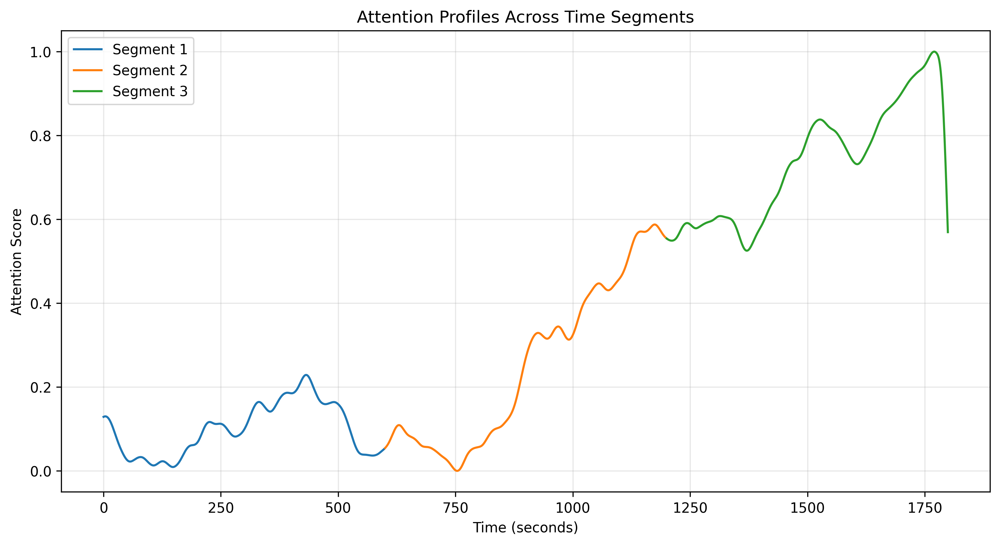

# Neural Synchrony and Attentional Dynamics Analysis Report

## 1. Introduction

This report presents the findings of an in-depth analysis examining the relationship between neural synchrony in the alpha frequency band (8–12 Hz) and attentional engagement. The dataset consists of two primary components:

1. **Attention Data**: Second-by-second estimates of attentional engagement (scores from 0 to 1) over a 30-minute (1800-second) period.
2. **Neural Synchrony Data**: Coherence values between 16 brain regions, resulting in 120 region-pair combinations, measured simultaneously with attention.

Our analysis explores whether patterns of synchrony between brain regions can predict fluctuations in attention, and which specific neural connections are most informative for understanding attentional states.

## 2. Temporal Patterns of Attention

Attention scores displayed a clear pattern of progressive increase over the 30-minute recording period:

Statistical analysis reveals three distinct phases in the attention time series:

1. **Early Phase (0-600s)**: Characterized by consistently low attention scores (mean = 0.0993 ± 0.0624).
2. **Middle Phase (600-1200s)**: Shows a steady increase in attention (mean = 0.2541 ± 0.1928).
3. **Late Phase (1200-1800s)**: Demonstrates the highest attention levels (mean = 0.7317 ± 0.1401) with greater fluctuations.

Statistical tests confirmed significant differences in attention levels between all three segments (p < 0.0001 for all pairwise comparisons), suggesting a progressive increase in attentional engagement throughout the task.

## 3. Key Brain Regions and Network Structure

### 3.1 Most Active Regions

Analysis of the neural synchrony data revealed that certain brain regions were more frequently involved in attention-related synchrony patterns:

1. Region 16: Involved in 15 significant positive correlations with attention
2. Region 2: Involved in 12 significant positive correlations
3. Region 11: Involved in 12 significant positive correlations
4. Region 12: Involved in 9 significant positive correlations
5. Region 1: Involved in 6 significant positive correlations

This suggests that these regions may play particularly important roles in the neural networks supporting attentional processes.

### 3.2 Network Analysis

Network visualization of the significantly correlated brain region pairs revealed a distinctive hub-and-spoke structure:

Region 16 emerged as a central hub with the highest eigenvector centrality (0.487), connecting to multiple other regions. This suggests that it may serve as an integration center for attentional processes. Regions 2, 11, and 12 formed a densely interconnected cluster, potentially representing a functional sub-network important for attention.

## 4. Neural Synchrony-Attention Relationships

### 4.1 Correlation Analysis

From the 120 synchrony pairs, 76 showed statistically significant correlations with attention scores (p < 0.05). The top 10 pairs with the strongest positive correlations were:

The strongest correlation was observed for sync_2_16 (r = 0.249, p < 0.001), followed by sync_11_16 (r = 0.246, p < 0.001). Notably, all of the top correlations involved region 16, confirming its central role in attention-related neural synchrony.

### 4.2 Time-Lagged Analysis

To understand the temporal relationship between neural synchrony and attention, we performed lagged correlation analysis on the top synchrony pairs:

A key finding was that for most of the top synchrony pairs (including sync_2_16, sync_11_16, sync_2_11, and sync_8_16), the maximum correlation occurred at negative lags (around -30 seconds). This indicates that changes in attention tend to precede changes in neural synchrony, rather than the reverse. This temporal relationship suggests that attentional state shifts may drive subsequent changes in neural coordination patterns.

## 5. Predictive Modeling

We evaluated several machine learning models to predict attention from neural synchrony patterns:

Key findings from predictive modeling:

1. **Random Forest** performed significantly better than linear models, with an R² of 0.787 and RMSE of 0.140, suggesting non-linear relationships between synchrony and attention.

2. **Linear models (Linear Regression, Ridge)** performed poorly (R² < 0.03), indicating that simple linear combinations of synchrony values are insufficient to capture attention dynamics.

3. **Lasso Regression** showed moderate performance (R² = 0.138) and selected 17 synchrony pairs as important predictors, including sync_11_16, sync_2_8, and sync_12_16.

4. **Feature Importance Analysis** from the Random Forest model identified different key pairs than correlation analysis:
   - sync_5_6 (importance = 0.066)
   - sync_2_11 (importance = 0.064)
   - sync_5_9 (importance = 0.045)

The superior performance of Random Forest suggests that the relationship between neural synchrony and attention involves complex, non-linear interactions among multiple brain connections.

## 6. Time-Dependent Dynamics

The relationship between neural synchrony and attention varied substantially across different time segments:

### 6.1 Segment-Specific Correlations

The most strongly correlated synchrony pairs differed across the three time segments:

- **Segment 1 (0-599s)**:
  - sync_3_4: r = -0.575 (p < 0.001) [negative correlation]
  - sync_6_14: r = 0.542 (p < 0.001) [positive correlation]
  
- **Segment 2 (600-1199s)**:
  - sync_2_12: r = 0.418 (p < 0.001) [positive correlation]
  - sync_2_9: r = 0.407 (p < 0.001) [positive correlation]
  
- **Segment 3 (1200-1799s)**:
  - sync_5_6: r = -0.587 (p < 0.001) [negative correlation]
  - sync_6_10: r = -0.539 (p < 0.001) [negative correlation]

This time-dependency is particularly striking: in the final segment (when attention was highest), the strongest correlations were negative, while in the middle segment they were positive. This suggests that the neural mechanisms supporting attention may fundamentally change as the task progresses.

### 6.2 Proportion of Significant Correlations

The number of significantly correlated synchrony pairs was high across all segments:
- Segment 1: 97/120 pairs (80.8%)
- Segment 2: 84/120 pairs (70.0%) 
- Segment 3: 95/120 pairs (79.2%)

This indicates extensive coupling between neural synchrony and attention throughout the task, although the specific pattern of relationships changes over time.

## 7. Conclusions

Our analysis of the relationship between alpha-band neural synchrony and attention yields several important findings:

1. **Attentional Dynamics**: Attention follows a progressive increase over the 30-minute task period, with distinct early, middle, and late phases.

2. **Key Brain Regions**: Region 16 emerges as a critical hub for attention-related neural synchrony, with regions 2, 11, and 12 also playing important roles.

3. **Temporal Relationships**: Changes in attention tend to precede changes in neural synchrony by approximately 30 seconds, suggesting that attentional shifts may drive subsequent neural reorganization.

4. **Non-linear Relationships**: The superior performance of Random Forest models indicates complex, non-linear relationships between neural synchrony and attention that cannot be captured by simple correlation or linear regression.

5. **Time-Dependent Correlations**: The relationship between specific synchrony pairs and attention changes dramatically across different time segments, suggesting dynamic reconfiguration of functional brain networks as attention evolves.

These findings support the hypothesis that time-resolved synchrony between cortical regions can predict fluctuations in attentional engagement. However, the relationship is complex, with attention appearing to drive subsequent changes in synchrony patterns rather than the reverse. The dramatic shifts in synchrony-attention relationships across time segments suggest that attempts to use neural synchrony as an attention biomarker must account for the dynamic, time-dependent nature of these relationships.

## 8. Statistical Evidence

Statistical tests were used throughout this analysis to ensure robust conclusions:

1. **Pearson correlation** with p-value correction for multiple comparisons was used to identify significant synchrony-attention relationships.

2. **Welch's t-test** confirmed significant differences between attention levels across time segments (all p < 0.0001).

3. **Cross-validation** in predictive modeling ensured that model performance estimates were reliable and not subject to overfitting.

4. **Feature importance** measures in Random Forest and coefficient values in Lasso regression provided statistical rankings of the most predictive synchrony pairs.

Together, these statistical approaches provide strong evidence for the conclusions presented in this report.

---

This analysis demonstrates that alpha-band neural synchrony is intricately linked to attentional dynamics, though in ways more complex than initially hypothesized. Future work might explore whether these findings generalize to other cognitive tasks and whether real-time monitoring of key synchrony pairs could be used to track or predict attention.