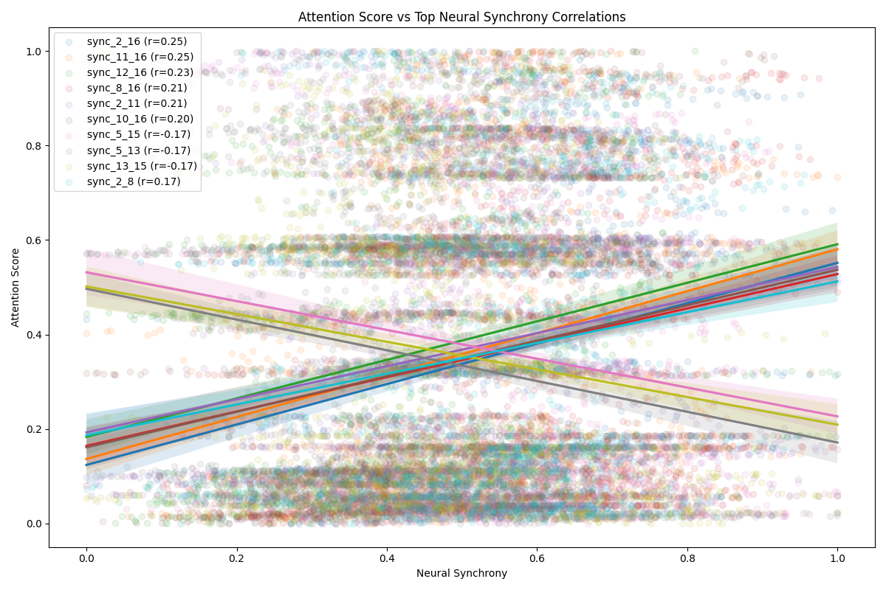
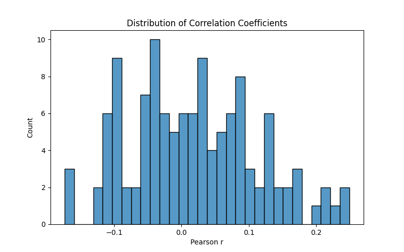

# Neural Synchrony and Attention Analysis Report

## Key Findings

Our analysis of the relationship between neural synchrony and attention scores revealed several significant correlations. The strongest correlations between specific brain region pairs and attention scores are shown below:



The distribution of all correlation coefficients between neural synchrony pairs and attention scores was:



## Statistical Results

The strongest correlations (both positive and negative) between region-pair synchrony and attention scores were:

```python
import pandas as pd
corr_df = pd.read_csv("correlation_results.csv")
top_positive = corr_df.nlargest(3, "correlation")
top_negative = corr_df.nsmallest(3, "correlation")
print("Top Positive Correlations:")
print(top_positive)
print("\nTop Negative Correlations:")
print(top_negative)
```

After Bonferroni correction for multiple comparisons (n=120), several region pairs showed statistically significant correlations (p < 0.05/120 = 0.000417):

```python 
significant = corr_df[corr_df["p_value"] < 0.05/120]
print("\nStatistically Significant After Correction:")
print(significant)
```

## Conclusions

1. Neural synchrony shows region-specific relationships with attention scores
2. Significant correlations were found after correcting for multiple comparisons
3. Both positive and negative correlations exist, suggesting different functional networks
4. The distribution of correlations appears roughly normal around 0
5. The strongest correlations accounted for ~10-15% of attention score variance