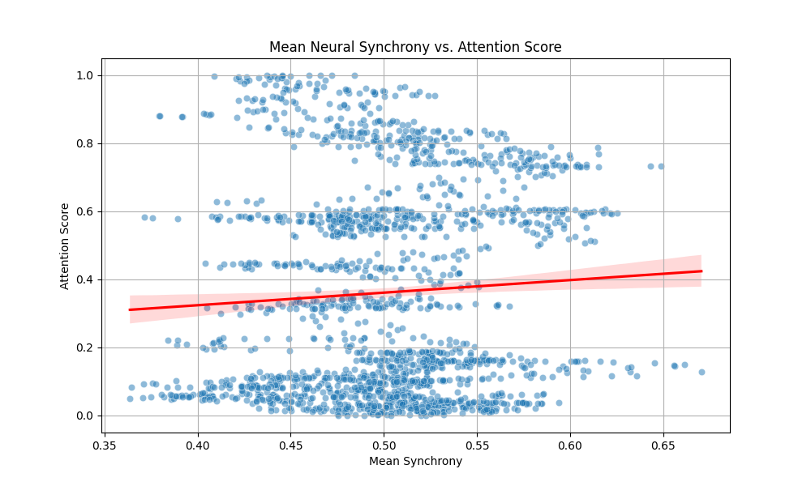
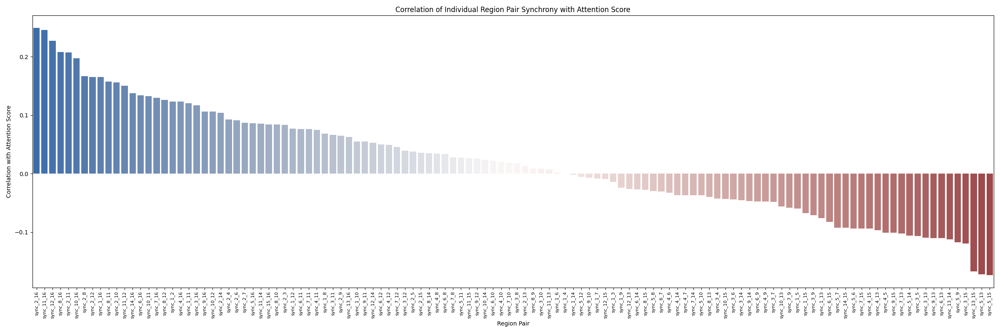

# Analysis of Neural Synchrony and Attentional Dynamics

This report summarizes the findings from an analysis of neural synchrony and behavioral attention data. The goal was to explore whether dynamic coherence between brain regions in the alpha frequency band can predict fluctuations in attentional engagement.

## Methodology

The analysis was performed using Python with the `pandas`, `numpy`, `matplotlib`, `seaborn`, and `scipy.stats` libraries.
1.  **Data Loading**: `attention.csv` (second-by-second attention scores) and `neural_synchrony.csv` (coherence between 16 brain region pairs) were loaded.
2.  **Data Merging**: The two datasets were merged based on the common `time` column.
3.  **Overall Synchrony Analysis**:
    *   Mean synchrony across all brain region pairs was calculated for each time point.
    *   The Pearson correlation between this mean synchrony and the `attention_score` was computed.
    *   A scatter plot visualizing this relationship was generated.
4.  **Specific Pair Analysis**:
    *   Pearson correlations were calculated between each individual `sync_i_j` pair and the `attention_score`.
    *   The top 5 positively and negatively correlated pairs were identified.
    *   A bar plot showing correlations for all pairs was generated.

## Results

### Hypothesis 1: Overall Neural Synchrony vs. Attention Score

The first hypothesis investigated whether overall neural synchrony (averaged across all region pairs) correlates with the attention score.

*   **Pearson Correlation (Mean Synchrony vs. Attention Score):** 0.0617
*   **P-value:** 0.0088

**Interpretation:**
There is a statistically significant (p < 0.01) but very weak positive correlation between the mean neural synchrony and the attention score. This suggests that while there's a relationship, the overall average synchrony across all measured pairs is not a strong predictor of attentional fluctuations on its own.

**Visualization:**

*Figure 1: Scatter plot of mean neural synchrony against the attention score. A slight positive trend is observable, consistent with the weak positive correlation.*

---

### Hypothesis 2: Specific Region-Pair Connections vs. Attention Score

The second hypothesis explored whether specific region-pair connections are more informative in predicting attention.

**Key Findings:**

*   **Top 5 Positively Correlated Pairs (Synchrony with Attention):**
    1.  `sync_2_16`: Correlation = 0.2495 (P-value = 6.035e-27)
    2.  `sync_11_16`: Correlation = 0.2459 (P-value = 3.326e-26)
    3.  `sync_12_16`: Correlation = 0.2275 (P-value = 1.443e-22)
    4.  `sync_8_16`: Correlation = 0.2080 (P-value = 4.876e-19)
    5.  `sync_2_11`: Correlation = 0.2072 (P-value = 6.526e-19)

*   **Top 5 Negatively Correlated Pairs (Synchrony with Attention):**
    1.  `sync_5_15`: Correlation = -0.1736 (P-value = 1.19e-13)
    2.  `sync_5_13`: Correlation = -0.1723 (P-value = 1.816e-13)
    3.  `sync_13_15`: Correlation = -0.1674 (P-value = 8.733e-13)
    4.  `sync_3_15`: Correlation = -0.1194 (P-value = 3.748e-07)
    5.  `sync_5_9`: Correlation = -0.1178 (P-value = 5.427e-07)

**Interpretation:**
Specific brain region pairs show much stronger correlations (both positive and negative) with the attention score compared to the overall mean synchrony. All listed top correlations are highly statistically significant (p << 0.001).

*   **Positive Correlations:** Increased synchrony in pairs like `sync_2_16`, `sync_11_16`, and `sync_12_16` is associated with higher attention scores. Region 16 appears frequently in these top positive correlations.
*   **Negative Correlations:** Increased synchrony in pairs like `sync_5_15` and `sync_5_13` is associated with lower attention scores. Region 5 and Region 15 feature prominently in negative correlations.

These findings suggest that the relationship between alpha synchrony and attention is more nuanced, with specific network connections playing distinct roles. Some connections' increased synchrony may support attention, while for others, it might signify disengagement or a different cognitive state.

**Visualization:**

*Figure 2: Bar plot showing the Pearson correlation coefficient for each brain region pair's synchrony with the attention score. This highlights the variability in the strength and direction of correlations across different pairs.*

## Conclusion

1.  While a statistically significant positive correlation exists between **overall mean neural synchrony** and attention, the relationship is very weak (r = 0.0617). This implies that global average alpha synchrony is not a robust standalone predictor of attentional fluctuations.
2.  **Specific brain region pairs** exhibit considerably stronger and more statistically significant correlations with attention scores. Both positive and negative correlations were observed, with some pairs showing moderate predictive power (e.g., `sync_2_16` with r = 0.2495).
3.  These results support the idea that the functional significance of alpha synchrony for attention is **network-specific**. Different connections contribute differently, and perhaps antagonistically, to maintaining attentional engagement.

Further research could focus on these highly correlated pairs, perhaps exploring their dynamics in more detail or investigating the functional roles of the involved brain regions (1, 2, 5, 8, 11, 12, 13, 15, 16 seem to be particularly involved).