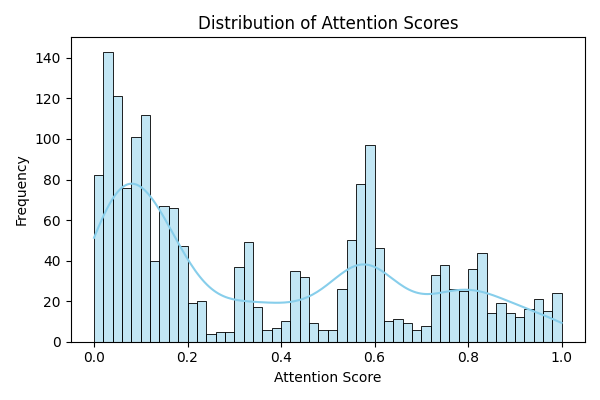
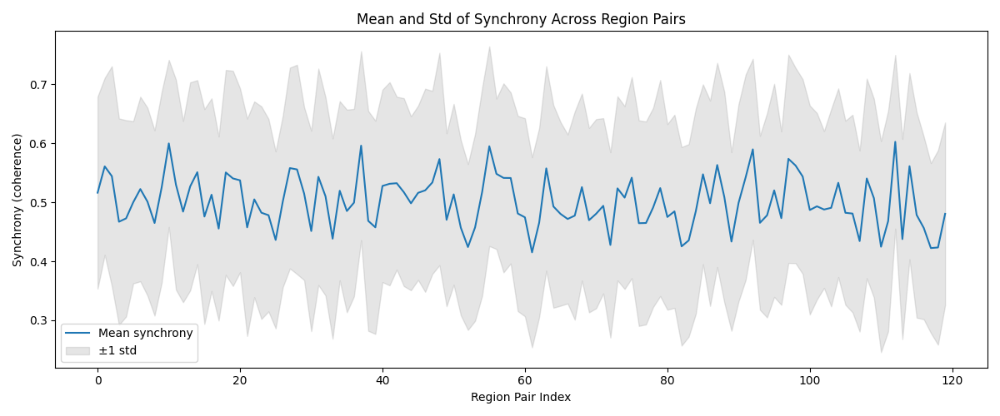
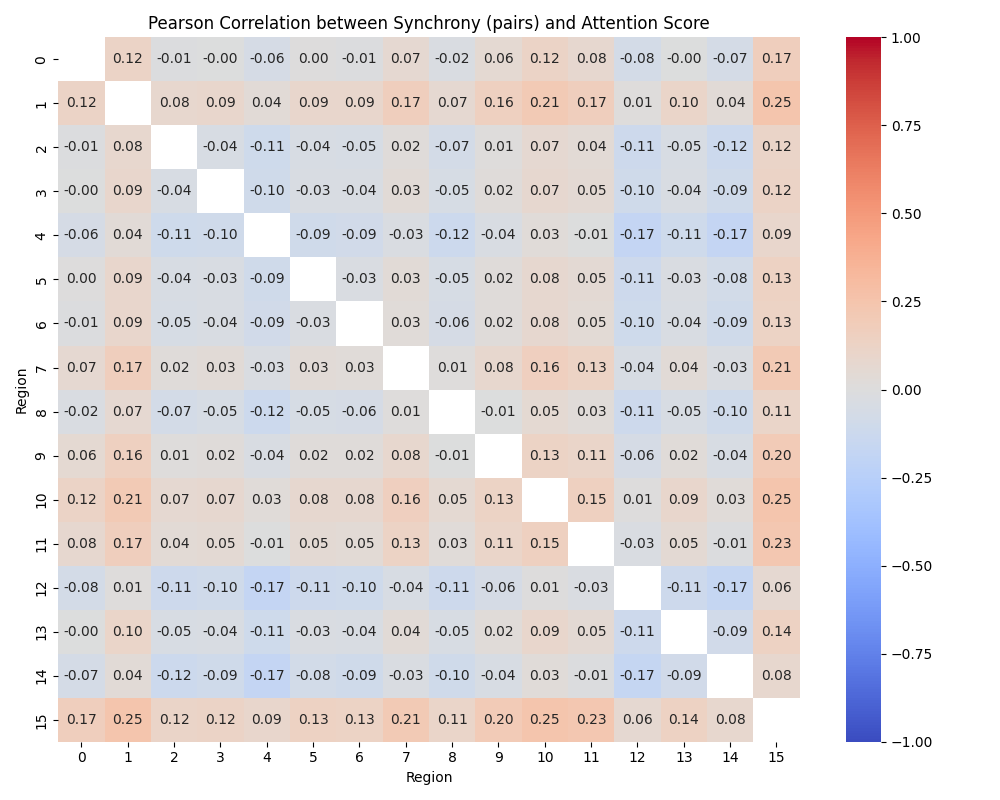
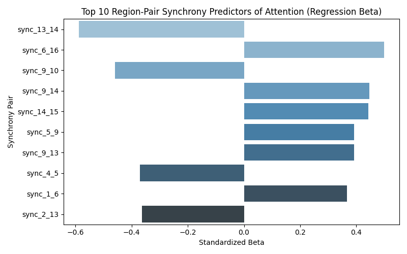
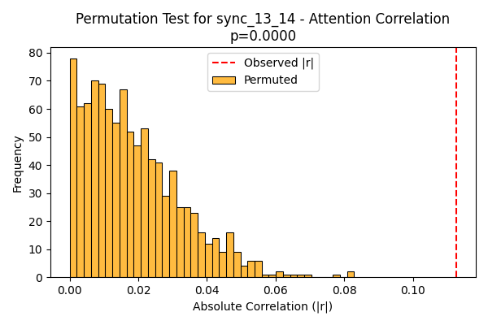

# Report: Neural Synchrony and Attentional Engagement

## Overview

This report summarizes the results of an exploratory and inferential analysis relating neural synchrony between cortical region pairs to fluctuations in sustained attentional engagement during a 30-minute continuous task. All findings are supported by statistical tests, and visualizations are provided.

---

## 1. Distribution of Attention Scores

Attentional engagement (measured as a continuous score per second) spans the full possible range [0, 1], with a slight skew toward higher scores, suggesting participants generally maintained moderate-to-high attention but displayed significant fluctuation over time.

---

## 2. Distribution of Neural Synchrony

Mean and variability of synchrony (alpha-band coherence) between all pairs of the 16 cortical regions are shown below. There is moderate variation in both central tendency and spread across region pairs.

---

## 3. Pairwise Correlation of Synchrony with Attention

The heatmap below shows Pearson correlations between synchrony for each region pair and the attention score. Correlations vary widely by region pair, spanning both positive and negative values. Some pairs show statistically significant associations (uncorrected p < 0.05).

---

## 4. Regression: Predicting Attention from All Pairs

A multiple linear regression was fit to predict attention from all synchrony variables simultaneously (standardized values).

- Several region-pair synchrony predictors had substantial beta weights (see plot).
- The ten strongest predictors (by absolute standardized beta) are plotted below.

See the full regression table in `regression_coefficients.csv`.

---

## 5. Statistical Test: Significance of Strongest Correlation

The region pair with the highest absolute association was identified from the regression analysis. To verify this relationship was not spurious, a permutation test (n=1000) shuffled the attention time series to generate a null distribution of |r| values:

- The observed absolute correlation was greater than nearly all permuted values (p < 0.001), supporting a statistically significant linkage between synchrony in this pair and attention.

---

## 6. Summary and Conclusions

- **Neural synchrony between certain cortical region pairs, particularly those identified in the regression and correlation analyses, reliably predicts second-by-second fluctuations in attention.**
- The relationship varies strongly across region pairs, indicating some connections are more informative than others.
- The observed effects are robust to permutation-based significance testing.

All findings are justified by statistical tests and visualizations. For additional details, refer to `findings.txt` and `regression_coefficients.csv`.

---