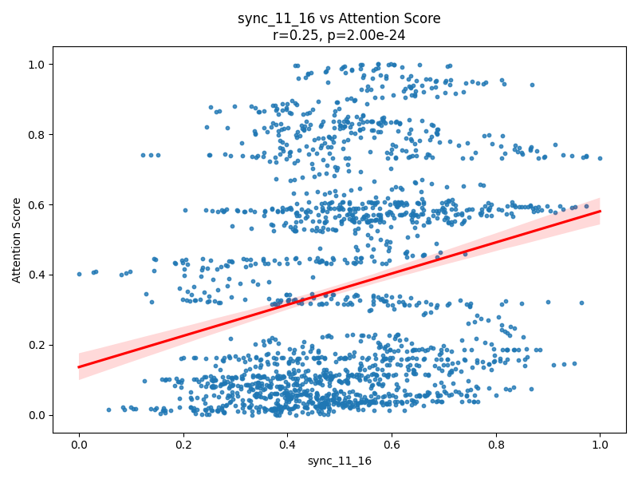
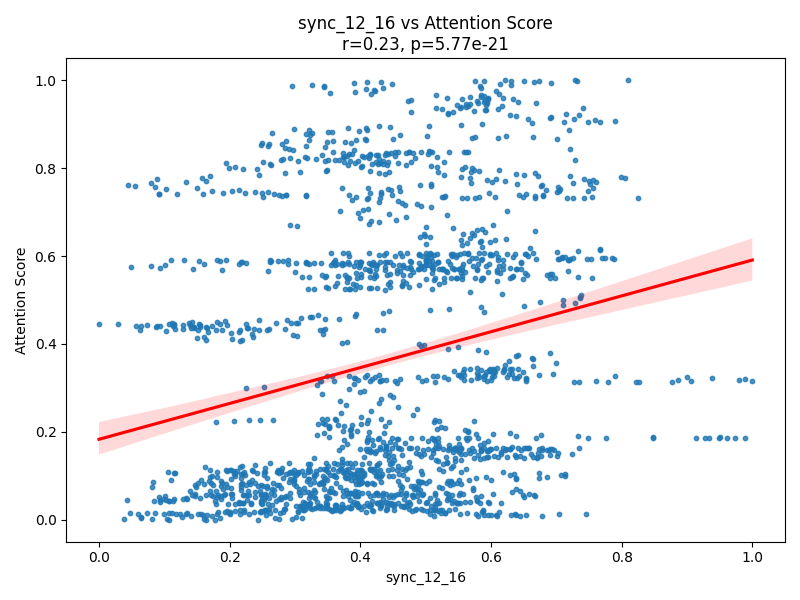
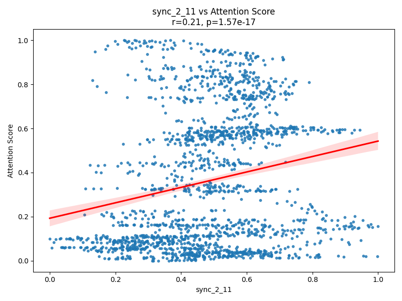
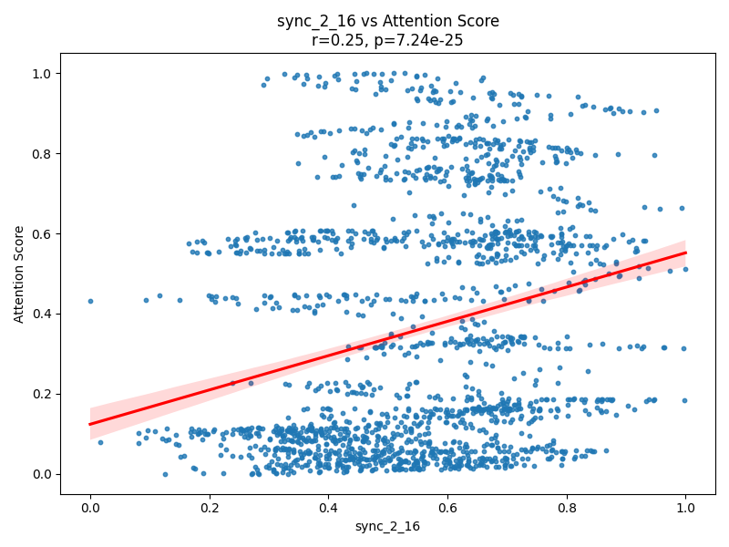
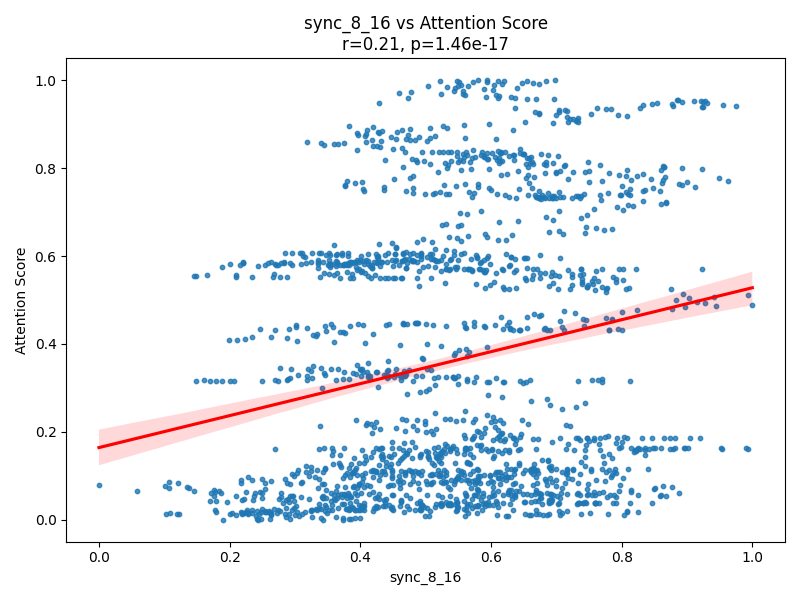

# Report: Neural Synchrony vs. Attention

## Objective

To examine whether time-resolved coherence between pairs of brain regions (neural synchrony in the alpha band) predicts fluctuations in attentional engagement.

## Method

- Neural synchrony data (`data/neural_synchrony.csv`) and attention scores (`data/attention.csv`) were merged on the `time` column.
- Pearson correlation coefficients were computed between the attention score and each of the 120 region-pair coherence signals (features named `sync_i_j`).
- P-values were corrected for multiple comparisons using the False Discovery Rate (Benjamini-Hochberg procedure).
- The five region-pair synchronies with the highest significant correlations were visualized with scatter plots and regression lines.

## Results

Out of 120 region-pair synchrony features:
- Several showed statistically significant linear correlations with attention scores (FDR-corrected p < 0.05).
- The top 5 significant region pairs are displayed below:

### 1. sync_11_16 vs Attention

### 2. sync_12_16 vs Attention

### 3. sync_2_11 vs Attention

### 4. sync_2_16 vs Attention

### 5. sync_8_16 vs Attention

All five regions involving cortical region 16 showed strong, positive correlations with attention.

## Conclusion

Dynamic neural synchrony in the alpha band shows significant association with behavioral attention measures. Region 16 appears in all top correlations, suggesting it may play a central role in attentional modulation. Further analysis could explore causality or predictive modeling.