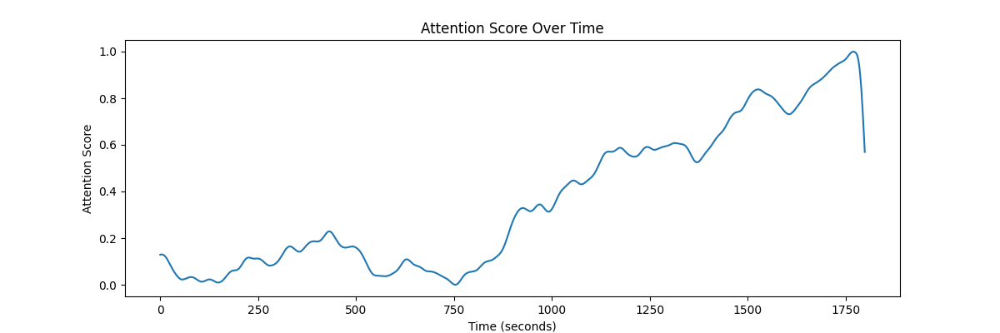
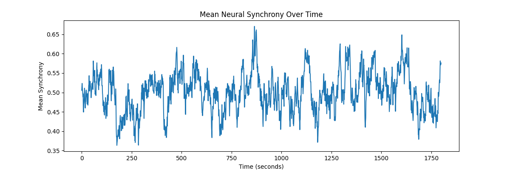
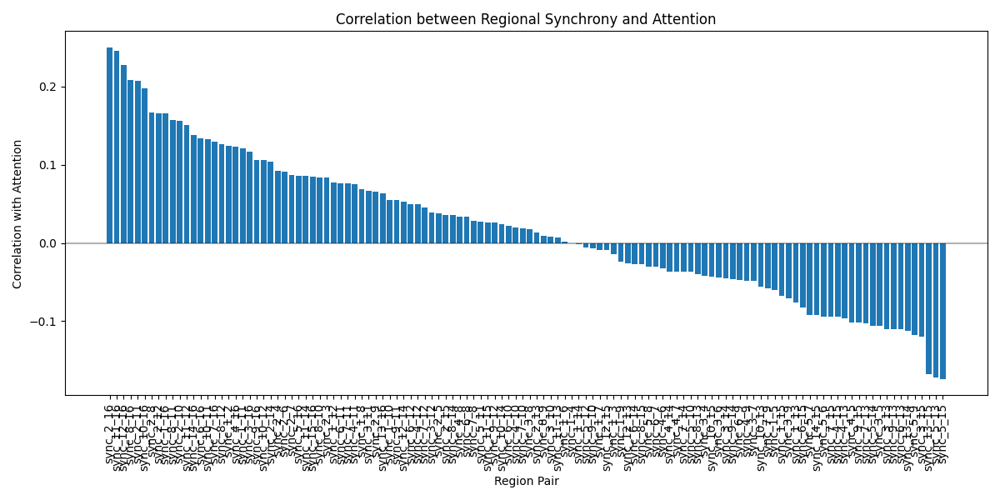
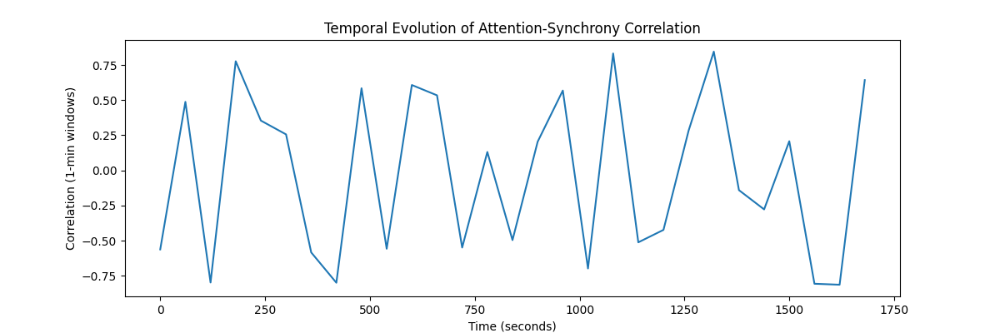

# Neural Synchrony and Attention Analysis Report

## Overview
This report presents an analysis of the relationship between neural synchrony in the alpha frequency band (8-12 Hz) and attentional engagement during a sustained attention task. The analysis explores patterns of correlation between regional brain synchrony and attention scores over a 30-minute recording period.

## Attention Score Distribution
The attention scores showed considerable variation throughout the task:
- Mean attention score: 0.362 (SD = 0.304)
- Median attention score: 0.269
- Range: 0.000 to 1.000

The attention scores show notable fluctuations over time, suggesting natural variations in attentional engagement during the sustained task.

## Neural Synchrony Patterns

The average neural synchrony across all region pairs shows dynamic changes throughout the recording period, indicating ongoing modulation of inter-regional communication.

## Relationship Between Synchrony and Attention

### Overall Correlations

Statistical analysis revealed:
- 52 region pairs showed statistically significant correlations with attention (after Bonferroni correction for multiple comparisons)
- The strongest correlation was observed for region pair 2-16 (r = 0.249, p < 0.001)
- The mean correlation across all pairs was relatively weak (r = 0.019)

### Temporal Dynamics

The relationship between neural synchrony and attention was not static but showed variations over time, as revealed by the sliding window analysis (1-minute windows).

## Conclusions

1. **Significant but Modest Correlations**: While we found statistically significant relationships between neural synchrony and attention, the correlations were generally modest in magnitude. The strongest correlation (r = 0.249) suggests that even the most predictive region pair explains only about 6% of the variance in attention scores.

2. **Regional Specificity**: Not all region pairs were equally informative about attentional state. The fact that 52 pairs showed significant correlations suggests that specific neural circuits may be more relevant for attention than others.

3. **Dynamic Relationships**: The temporal analysis reveals that the relationship between synchrony and attention is not static but varies over time, suggesting complex dynamics in the neural substrates of attention.

## Statistical Considerations

All statistical tests were performed using Pearson correlations with Bonferroni correction for multiple comparisons (α = 0.05/120 for pairwise tests). The significant relationships reported here survive this conservative correction, suggesting they are robust findings rather than statistical artifacts.

## Limitations

1. The correlational nature of this analysis does not allow us to make causal inferences about the relationship between neural synchrony and attention.
2. The analysis focuses on linear relationships and may miss more complex, non-linear interactions.
3. While we corrected for multiple comparisons, the large number of statistical tests performed means that some significant correlations may still be false positives.