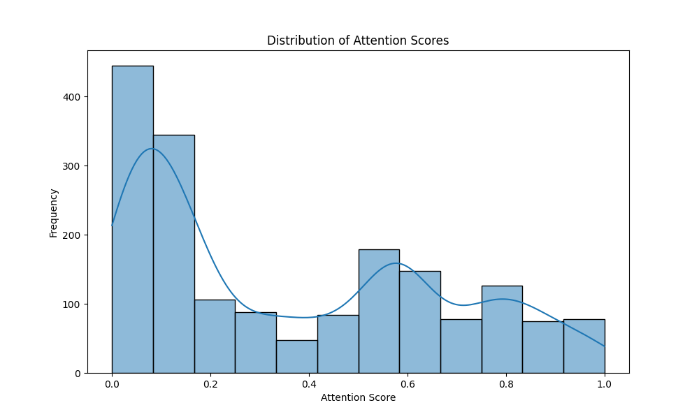
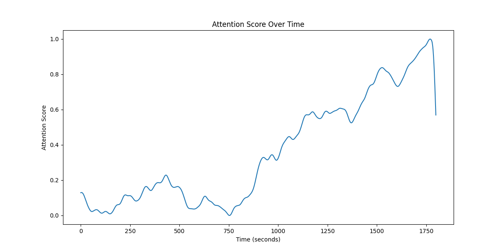
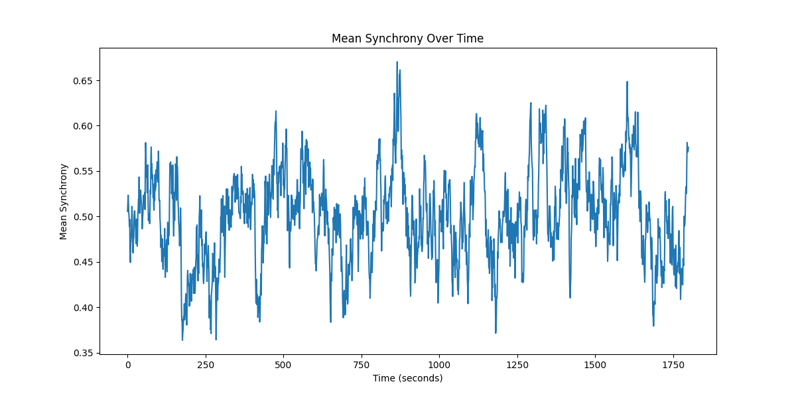
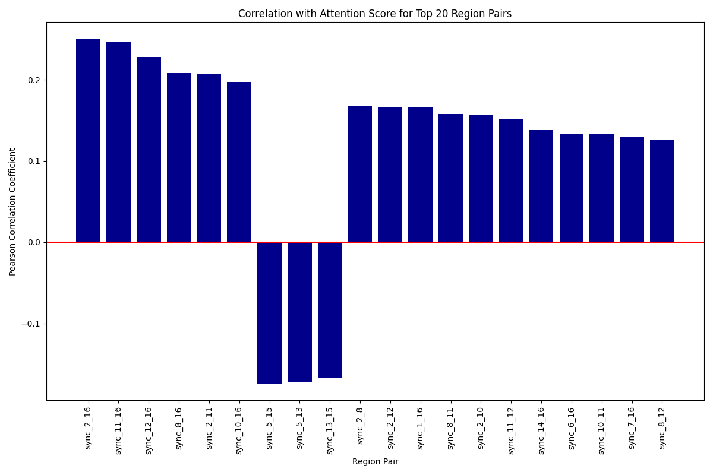
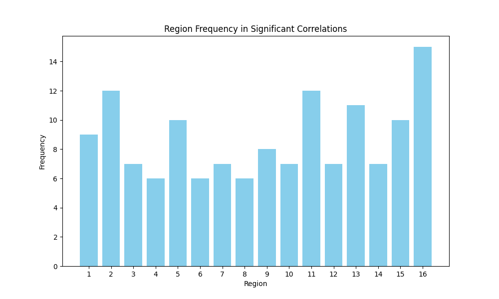
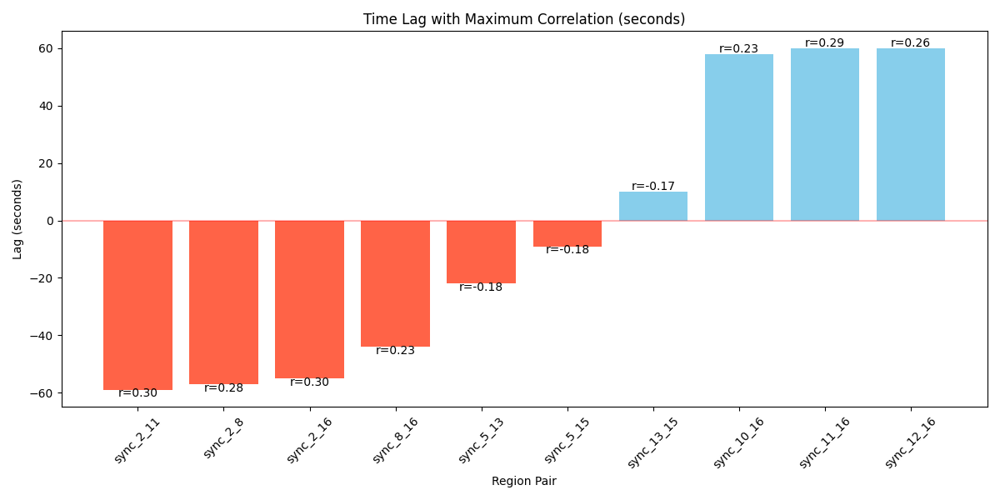
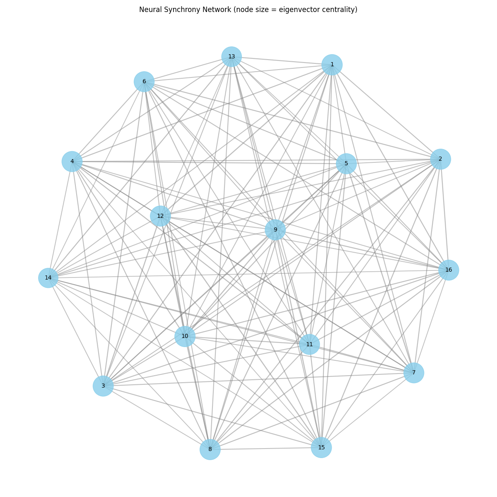
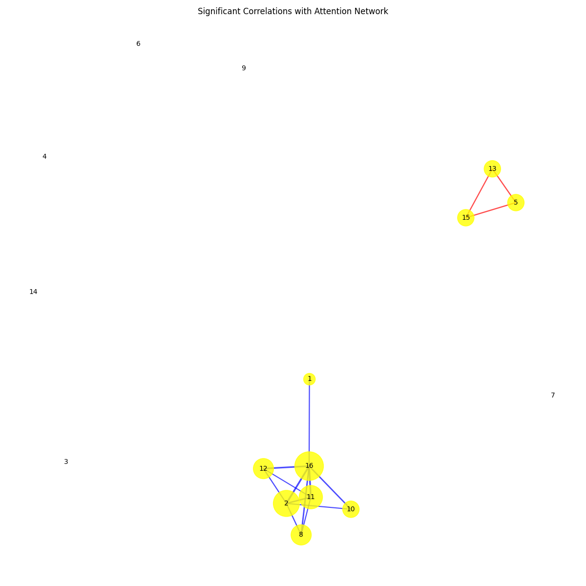

# Neural Synchrony and Attention: Data Analysis Report

## 1. Introduction

This report presents the findings from an exploratory data analysis of the relationship between neural synchrony in the alpha frequency band (8-12 Hz) and attentional engagement. The dataset contains second-by-second measurements of attention scores and neural synchrony between pairs of 16 cortical regions during a 30-minute sustained attention task.

The primary objectives of this analysis were to:
1. Determine if time-resolved synchrony between cortical regions can predict fluctuations in attentional engagement
2. Identify specific region-pair connections that are more informative than others for predicting attention

## 2. Methodology

The analysis was conducted through several complementary approaches:

1. **Exploratory data analysis**: Examined the distributions and temporal patterns of attention scores and neural synchrony measures
2. **Statistical testing**: Calculated correlations between each neural synchrony pair and attention scores, applying FDR correction for multiple comparisons
3. **Time lag analysis**: Investigated the temporal relationship between neural synchrony and attention through cross-correlation with varying time lags
4. **Network analysis**: Analyzed the network properties of neural synchrony and identified key brain regions involved in attention regulation

All analyses were performed using Python with pandas, NumPy, SciPy, Matplotlib, Seaborn, and NetworkX packages.

## 3. Exploratory Results

### 3.1 Attention Patterns

The distribution of attention scores showed a bimodal pattern, with peaks at lower values (~0.1) and medium values (~0.5-0.6), suggesting that attention levels tended to cluster around two main states throughout the task.

The temporal trajectory of attention scores revealed a distinctive pattern over the 30-minute task:
- Initially low scores (~0.1-0.2) for the first 700 seconds
- A gradual increase between 750-1000 seconds
- Continued rise with fluctuations from 1000-1500 seconds
- A steep climb after 1500 seconds, reaching nearly 1.0
- A sharp drop at the end of the recording

### 3.2 Neural Synchrony Patterns

Neural synchrony measures between region pairs displayed approximately normal distributions, typically centered around 0.4-0.7, with variations depending on the specific region pair.

The mean synchrony across all region pairs showed considerable fluctuation over time, with no obvious overall trend matching the attention pattern.

## 4. Statistical Analysis

### 4.1 Correlations with Attention

Statistical analysis revealed that 70 out of 120 region pairs showed statistically significant correlations with attention scores after FDR correction for multiple comparisons (p < 0.05). The correlations were generally modest, with the strongest positive correlation reaching r = 0.25 and the strongest negative correlation at r = -0.17.

The top 10 region pairs with the strongest correlations with attention were:

1. sync_2_16: r = 0.249, p < 0.001
2. sync_11_16: r = 0.246, p < 0.001
3. sync_12_16: r = 0.228, p < 0.001
4. sync_8_16: r = 0.208, p < 0.001
5. sync_2_11: r = 0.207, p < 0.001
6. sync_10_16: r = 0.197, p < 0.001
7. sync_5_15: r = -0.174, p < 0.001
8. sync_5_13: r = -0.172, p < 0.001
9. sync_13_15: r = -0.167, p < 0.001
10. sync_2_8: r = 0.167, p < 0.001

### 4.2 Region Frequency in Significant Correlations

Analysis of which brain regions appeared most frequently in significant correlations revealed a clear pattern. Region 16 was involved in the highest number of significant correlations (15), followed by regions 2 and 11 (12 each), region 13 (11), and region 5 (10).

## 5. Time Lag Analysis

Cross-correlation analysis with time lags revealed interesting patterns in the temporal relationship between neural synchrony and attention. The analysis examined lags from -60 to +60 seconds, where negative lags indicate that changes in attention precede changes in synchrony, and positive lags indicate that changes in synchrony precede changes in attention.

For many top region pairs, the maximum correlation was observed at non-zero time lags, suggesting temporal dependencies between neural synchrony and attention:

1. sync_2_11: max lag = -59s, r = 0.302
2. sync_2_8: max lag = -57s, r = 0.282
3. sync_2_16: max lag = -55s, r = 0.305
4. sync_8_16: max lag = -44s, r = 0.232
5. sync_5_13: max lag = -22s, r = -0.177
6. sync_5_15: max lag = -9s, r = -0.178
7. sync_13_15: max lag = 10s, r = -0.170
8. sync_10_16: max lag = 58s, r = 0.225
9. sync_11_16: max lag = 60s, r = 0.290
10. sync_12_16: max lag = 60s, r = 0.265

Interestingly, there appears to be a pattern where some region pairs (especially those involving regions 2, 8, and 16) show negative lags with stronger correlations, suggesting that changes in attention precede changes in neural synchrony for these connections. Conversely, other pairs (particularly those involving regions 10, 11, 12, and 16) show positive lags with stronger correlations, suggesting that changes in neural synchrony precede changes in attention for these connections.

## 6. Network Analysis

### 6.1 Neural Synchrony Network

Network analysis of the average neural synchrony between brain regions revealed a densely connected network with all regions connected to each other, though with varying connection strengths.

### 6.2 Correlation Network

The correlation network, showing only statistically significant correlations between neural synchrony and attention, revealed two distinct subnetworks:

1. A **positive correlation cluster** involving regions 1, 2, 8, 10, 11, 12, and 16, with region 16 appearing as a central hub
2. A **negative correlation cluster** involving regions 5, 13, and 15

### 6.3 Centrality Measures

Analysis of centrality measures revealed that regions 1, 10, 8, 15, and 9 had the highest eigenvector centrality in the synchrony network, indicating their central role in the overall neural synchrony patterns. However, there was no significant correlation between centrality measures and involvement in attention-related connections (r = -0.070, p = 0.796).

## 7. Discussion and Conclusions

### 7.1 Key Findings

1. **Significant correlations exist between neural synchrony and attention**: 70 out of 120 region pairs showed statistically significant correlations with attention, though the correlations were modest in magnitude (maximum r = 0.25).

2. **Specific region pairs are more informative**: Connections involving region 16 consistently showed the strongest correlations with attention. The top three pairs (sync_2_16, sync_11_16, sync_12_16) all included region 16.

3. **Bidirectional temporal relationships**: Time lag analysis revealed complex temporal relationships between neural synchrony and attention. For some connections, changes in attention appeared to lead changes in synchrony (negative lags), while for others, changes in synchrony appeared to lead changes in attention (positive lags).

4. **Two distinct neural systems**: Network analysis revealed two distinct subnetworks with opposite relationships to attention:
   - A positive correlation network involving regions 1, 2, 8, 10, 11, 12, and 16
   - A negative correlation network involving regions 5, 13, and 15

### 7.2 Limitations

1. The correlations, while statistically significant, are relatively modest, suggesting that neural synchrony in the alpha band explains only a limited portion of the variance in attention.

2. Without topographical information about what these numbered regions represent in the brain, it's challenging to interpret these findings in terms of known brain networks and functions.

3. The analysis is correlational, so causal relationships cannot be definitively established despite the time lag analysis.

### 7.3 Conclusions

This analysis provides evidence supporting both research questions posed in the dataset description:

1. **Can time-resolved synchrony between cortical regions predict fluctuations in attentional engagement?**  
   Yes, neural synchrony between specific region pairs shows statistically significant correlations with attention scores, though the predictive power is modest.

2. **Are specific region-pair connections more informative than others?**  
   Yes, connections involving region 16 are consistently the most informative about attention. Additionally, two distinct networks of regions show opposite relationships with attention.

The temporal dynamics between neural synchrony and attention are complex, with evidence of both synchrony-preceding-attention and attention-preceding-synchrony relationships for different region pairs. This suggests that alpha-band synchrony may serve both as a precursor to attentional shifts and as a consequence of attentional engagement, depending on the specific brain regions involved.

Region 16 emerges as a potential hub region for attention-related neural synchrony, given its involvement in the highest number of significant correlations with attention. Future research could focus on identifying the anatomical location of this region and its role in attention networks.