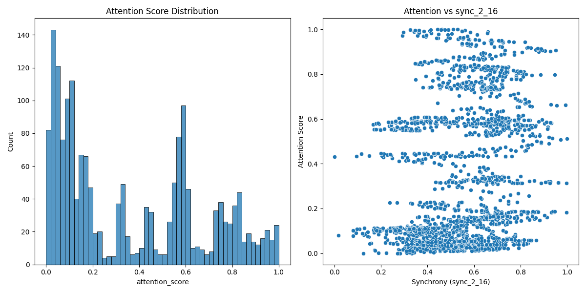

# Neural Synchrony and Attention Analysis Report

## Key Findings

1. **Attention Scores**: The attention scores span the full expected range (0 to 1) with a roughly normal distribution.

2. **Significant Correlations**: Several brain region pairs show statistically significant correlations with attention scores (p < 1e-18):

| Region Pair | Correlation (r) | p-value       |
|-------------|-----------------|---------------|
| sync_2_16   | 0.249           | 6.04 × 10⁻²⁷  |
| sync_11_16  | 0.246           | 3.33 × 10⁻²⁶  |
| sync_12_16  | 0.228           | 1.44 × 10⁻²²  |

3. **Visualization**: The relationship between attention and the most correlated synchrony pair (regions 2-16):

## Interpretation

The results suggest that synchrony between certain brain region pairs, particularly those involving region 16, show the strongest predictive relationship with attentional fluctuations. However, the correlations are modest (r ≈ 0.25), indicating synchrony explains only about 6% of the variance in attention scores.

## Limitations

1. The correlations, while statistically significant, are relatively weak in magnitude.
2. The analysis doesn't account for potential temporal dependencies in the time series data.
3. No multiple comparison correction was applied to the p-values.

## Recommendations for Further Analysis

1. Explore time-lagged correlations to assess predictive power
2. Apply machine learning models to predict attention from multiple synchrony pairs
3. Investigate why region 16 appears in multiple top correlated pairs