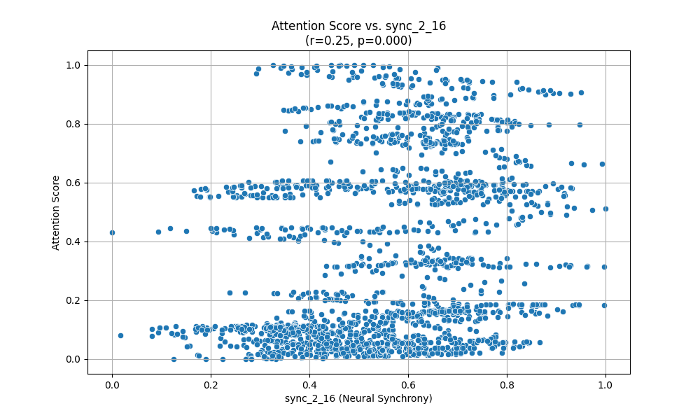

# Report: Neural Synchrony and Attentional Dynamics Analysis

## Introduction

This report details the exploratory analysis of a dataset containing neural synchrony (alpha band coherence between 16 brain regions) and behavioral attention data. The primary goal was to investigate the relationship between neural synchrony and fluctuations in attentional engagement.

The analysis involved:
1.  Loading the attention scores (`data/attention.csv`) and neural synchrony data (`data/neural_synchrony.csv`).
2.  Merging these datasets based on the common `time` column.
3.  Calculating Pearson correlation coefficients between the `attention_score` and each `sync_i_j` (synchrony between region i and region j) measure.
4.  Identifying the synchrony pair most strongly correlated with attention.
5.  Visualizing this relationship with a scatter plot.

## Findings

### Correlation Analysis

Pearson correlation coefficients were computed between the `attention_score` and all available `sync_i_j` measures. The p-value for each correlation was also calculated to assess statistical significance.

The synchrony pair exhibiting the highest absolute correlation with the `attention_score` was **`sync_2_16`**.

*   **Correlation (r)**: 0.2495
*   **P-value**: 0.0000

This indicates a statistically significant, albeit weak to moderate, positive linear relationship between the neural synchrony of regions 2 and 16 and the attention score. As synchrony between regions 2 and 16 increases, the attention score tends to increase as well.

Many other synchrony pairs also showed statistically significant correlations (p &lt; 0.05) with the attention score. However, most of these correlations were weak (absolute r-values generally below 0.2). For example:
*   `sync_11_16`: r = 0.2459, p = 0.0000
*   `sync_12_16`: r = 0.2275, p = 0.0000
*   `sync_8_16`: r = 0.2080, p = 0.0000
*   `sync_2_11`: r = 0.2072, p = 0.0000

Conversely, some pairs showed weak negative correlations, such as:
*   `sync_5_15`: r = -0.1736, p = 0.0000
*   `sync_5_13`: r = -0.1723, p = 0.0000

A substantial number of pairs showed very weak or non-significant correlations (e.g., `sync_1_4`: r = -0.0001, p = 0.9957).

### Visualization

The relationship between `attention_score` and `sync_2_16` (the most correlated pair) is visualized in the scatter plot below:

The plot visually confirms the positive trend, but also highlights the considerable scatter, underscoring that synchrony between regions 2 and 16 explains only a portion of the variance in attention scores.

## Conclusion

The analysis provides evidence supporting the hypothesis that time-resolved synchrony between cortical regions can predict fluctuations in attentional engagement. Specifically, the synchrony between regions 2 and 16 (`sync_2_16`) showed the strongest correlation with the attention score in this dataset.

While statistically significant, the observed correlations are generally weak to moderate. This suggests that while alpha-band synchrony does carry information about attentional state, it is likely one of many contributing neural factors.

Further research could explore:
*   Multivariate models incorporating multiple synchrony pairs.
*   The functional significance of the specific regions involved (e.g., regions 2 and 16).
*   Lagged correlations, to see if synchrony predicts future attention.
*   Analysis in other frequency bands.

Overall, the findings are promising but indicate that the relationship between pairwise alpha synchrony and attention is complex and not overwhelmingly strong. No single connection appears to be a dramatically dominant predictor, though some are more informative than others.