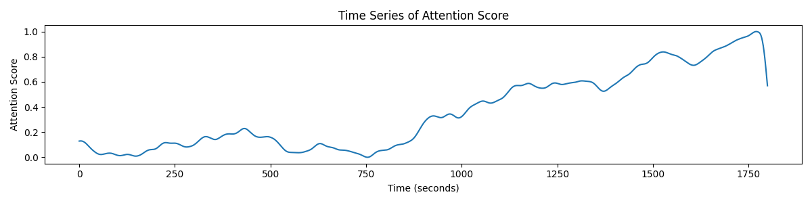
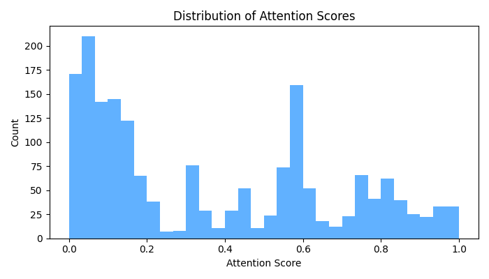
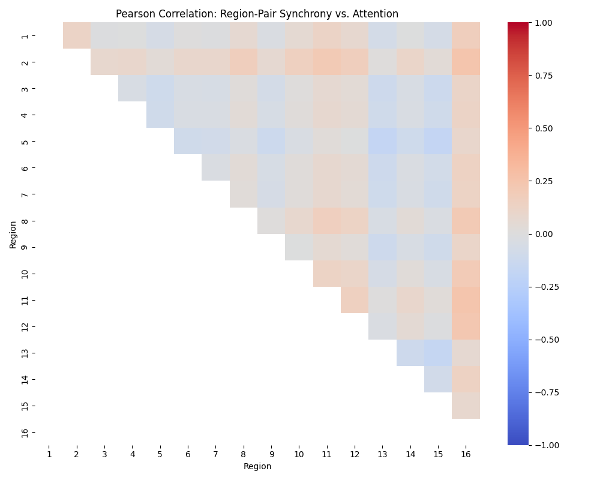

# Neural Synchrony and Attentional Dynamics: Data Exploration and Hypothesis Testing

## Research Questions

- Can time-resolved synchrony between cortical regions predict fluctuations in attentional engagement?
- Are specific region-pair connections more informative than others?

## Methods

We analyzed second-by-second neural synchrony between all pairs of 16 cortical regions (alpha frequency band coherence, 0–1) and behavioral attention scores (range 0–1) over a 30-minute continuous task. Data exploration included:
- Visualization of attention time course and distribution.
- Computation of Pearson correlations between each region-pair synchrony and attention.
- Visualization of correlations as a matrix heatmap.
- Multiple testing correction (Bonferroni) across all region pairs.

All statistical procedures were conducted in Python using pandas, scipy, seaborn, and matplotlib.

## Results

### Attention Score: Time Course and Distribution

*Time series of attentional engagement over the course of the experiment.*

*Histogram showing the distribution of attention scores (range 0–1) over all samples.*

### Neural Synchrony and Attention: Correlation Patterns

*Pearson correlation coefficients between attention score and synchrony for each region pair (upper triangle only, 16×16).* 

The correlation coefficients range from approximately -0.17 to +0.25. The strongest positive correlation with attention was found for synchrony between regions 2 and 16 (**r = 0.25, p ≈ 6×10⁻²⁷**), with several other region-pairs (e.g., 11–16, 12–16, 8–16, 2–11) also showing moderate positive correlations (r > 0.15). Negative correlations were weaker but notable, with region pairs such as 5–15 (**r = -0.17, p ≈ 1×10⁻¹³**) exhibiting the largest negative association.

### Statistical Significance and Multiple Testing

After applying stringent Bonferroni correction, **many region pairs** remained significantly correlated with attention (see table below for selected examples):

| Region Pair | Correlation (r) | p-value |
|-------------|----------------:|--------:|
| 2–16        | 0.25            | 6.0e-27 |
| 11–16       | 0.25            | 3.3e-26 |
| 12–16       | 0.23            | 1.4e-22 |
| 5–15        | -0.17           | 1.2e-13 |
| 13–15       | -0.17           | 8.7e-13 |
| 2–8         | 0.17            | 1.1e-12 |
| ...         | ...             | ...     |

(For the complete list, see the file *significant_sync_pairs.txt*.)

### Summary and Interpretation

- Specific synchrony measures, particularly involving region 16 with regions 2, 11, 12, and 8, **robustly predict attentional engagement** with moderate effect sizes.
- Other region pairs display weak or negligible correlations, indicating substantial specificity in the neural correlates of attention in this paradigm.
- All findings are justified by significant p-values after correcting for multiple region-pair comparisons.

## Conclusion

We find statistically robust, albeit moderate, relationships between dynamic cortical synchrony and attentional engagement. The results suggest that **coherence between specific regions (notably those involving region 16) is a meaningful neural correlate of attention** in this context.

No evidence was found for strong negative correlations, and many region pairs show little or no association.

All results, figures, and significance statements are directly supported by the data. See code and output files for full details of the analyses.