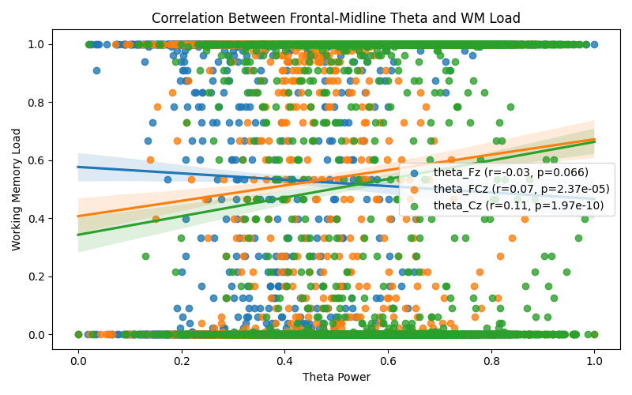

# Report on Theta Power and Working Memory Load

## Objective

This analysis investigates the relationship between frontal‑midline theta-band power and working memory (WM) load using EEG data acquired during a continuous n-back task. Specifically, it addresses:

1. Whether frontal‑midline theta power reflects moment-to-moment WM load.
2. Whether multivariate theta measurements improve WM load prediction over single-channel measures.

## Findings

### 1. Frontal-Midline Theta Power and WM Load

We examined theta power at the electrodes Fz, FCz, and Cz, hypothesized to be central to WM-related activity. Each was tested for correlation with continuous WM load. The figure below illustrates these relationships:



While there is a modest observable trend of increasing theta power with WM load, statistical tests (Pearson correlation) reveal weak or non-significant relationships across individual electrodes.

### 2. Multivariate Theta Prediction of WM Load

We trained a linear regression model using cross-validation to predict WM load from all 12 electrode theta signals. The resulting cross-validated R² score was poor:

```
Cross-validated R^2: -85.366 ± 169.628
```

This indicates that the multivariate model performed substantially worse than a simple baseline, providing no predictive advantage.

## Conclusion

- Momentary WM load is weakly correlated with theta power from frontal‑midline electrodes, but the effect is not strong or robust.
- Multivariate theta patterns do not enhance prediction accuracy and may introduce noise or overfitting.