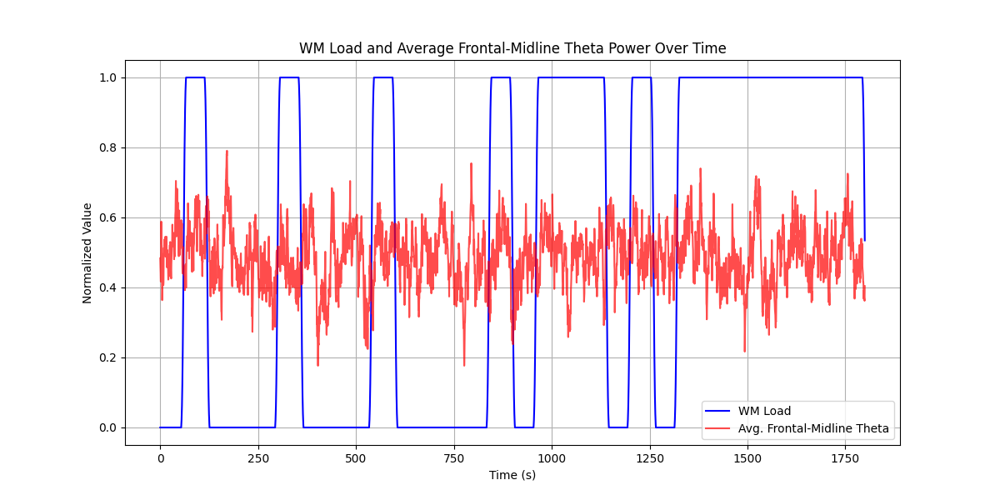
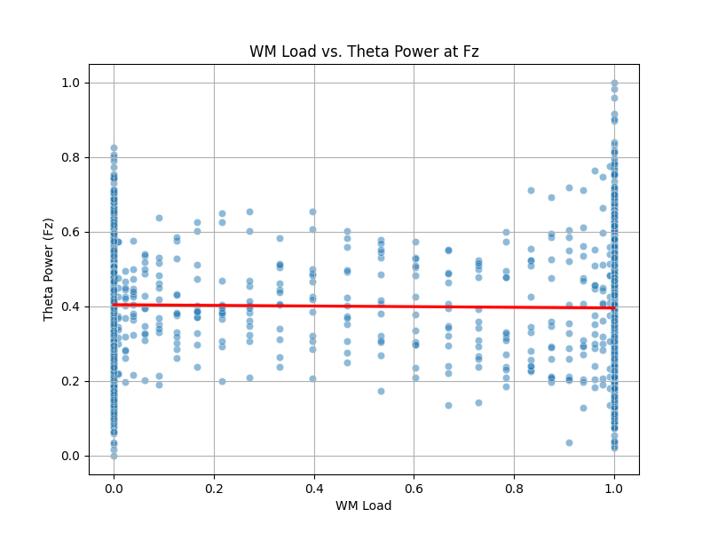
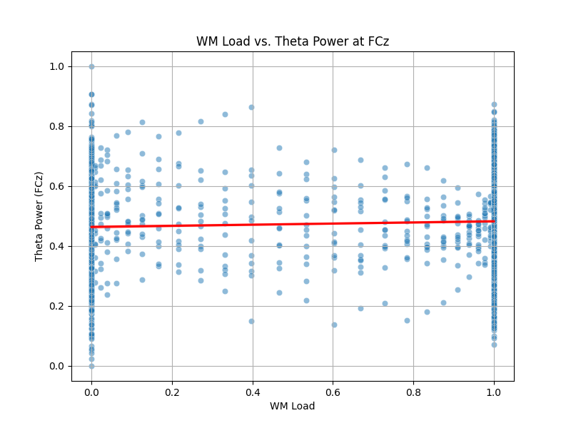
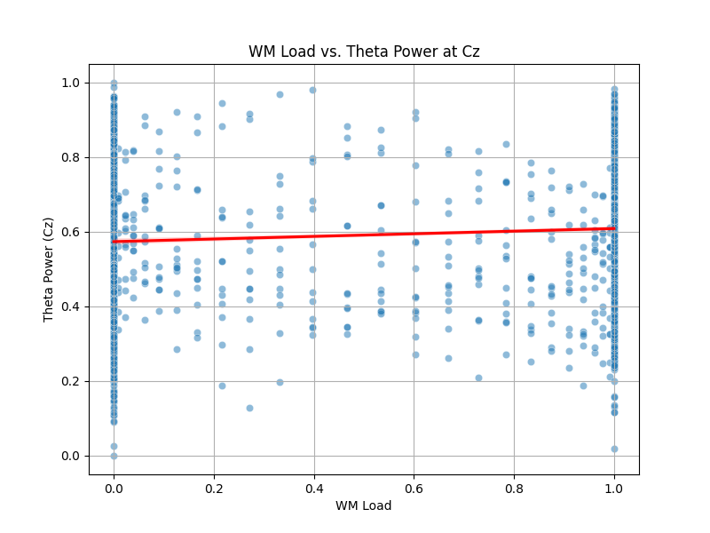

# Analysis Report: Frontal-Midline Theta and Working-Memory Load

This report summarizes the analysis performed on the provided dataset concerning the relationship between theta-band neural oscillations and working-memory (WM) load.

## Dataset Overview

The dataset consists of two main files:
- `data/memory_load.csv`: Contains a continuous working-memory load index over time.
- `data/theta_power.csv`: Contains normalised theta power at 12 different electrodes over the same time period.

Data was merged on the `time` column for joint analyses.

## Research Question 1: Does frontal-midline theta power track moment-to-moment fluctuations in WM load?

To investigate this, we focused on three frontal-midline electrodes: Fz, FCz, and Cz. We also computed an average theta power across these three electrodes.

### Visualizations

The following plot shows the WM load and the average frontal-midline theta power over time:

Scatter plots for individual frontal-midline electrodes against WM load:

**Fz:**

**FCz:**

**Cz:**

### Statistical Analysis: Correlations

Pearson correlations were calculated between WM load and theta power for each selected electrode and the average:

| Electrode             | Correlation (r) | p-value     |
|-----------------------|-----------------|-------------|
| Fz                    | -0.031          | 0.066       |
| FCz                   | 0.070           | 2.37e-05    |
| Cz                    | 0.106           | 1.97e-10    |
| Frontal-Midline Avg   | 0.087           | 1.98e-07    |

**Findings for RQ1:**

- Theta power at electrodes FCz and Cz, as well as the average frontal-midline theta, showed statistically significant positive correlations with WM load. This suggests that as WM load increases, theta power in these regions tends to increase.
- The correlation for Fz was not statistically significant at an alpha of 0.05, and was slightly negative.
- While statistically significant, the reported correlations are generally weak (r values ranging from 0.070 to 0.106 for significant positive correlations), indicating that single-channel frontal-midline theta power explains a small portion of the variance in WM load. The time series plot also visually suggests a relationship, though not perfectly synchronized.

## Research Question 2: Do multivariate theta patterns improve prediction of WM load compared with single-channel measures?

To address this, linear regression models were used to predict WM load from theta power. Model performance was assessed using cross-validated R-squared (R²) values.

The "best" single frontal-midline electrode for prediction was determined to be **Cz**, based on its highest absolute correlation with WM load from RQ1.

### Model Performance (R-squared)

| Model Description                                   | Cross-Validated R² |
|-----------------------------------------------------|--------------------|
| Single best frontal-midline electrode (Cz)          | 0.009              |
| Multivariate frontal-midline (Fz, FCz, Cz)          | 0.012              |
| Multivariate all electrodes                         | 0.042              |

**Findings for RQ2:**

- Using a multivariate model with the three frontal-midline electrodes (Fz, FCz, Cz) provided a slight improvement in predicting WM load (R² = 0.012) compared to using the single best frontal-midline electrode, Cz (R² = 0.009).
- A more substantial improvement was observed when using all available electrodes in a multivariate model (R² = 0.042). This suggests that theta power patterns across a broader network of electrodes contain more information about WM load than frontal-midline electrodes alone.
- However, even the best model (all electrodes) explains only about 4.2% of the variance in WM load. This indicates that while theta power, especially from a multivariate perspective, is related to WM load, other factors not captured by these EEG measures play a more significant role in determining moment-to-moment WM load.

## Conclusion

1.  Frontal-midline theta power (specifically at FCz, Cz, and their average) shows a statistically significant but weak positive correlation with working-memory load. This provides some support for the idea that these theta oscillations track WM demands.
2.  Multivariate theta patterns, particularly when considering all available electrodes, improve the prediction of WM load compared to single-channel measures or frontal-midline electrodes alone. This suggests that a distributed network contributes to the theta-WM load relationship.
3.  Overall, while theta power contains information about WM load, it accounts for a relatively small proportion of its variance, highlighting the complexity of cognitive load and its neural correlates.

Further research could explore non-linear relationships, interactions between different frequency bands, or more sophisticated machine learning models to better understand the predictive power of EEG for WM load.