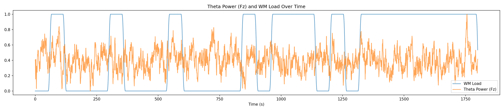
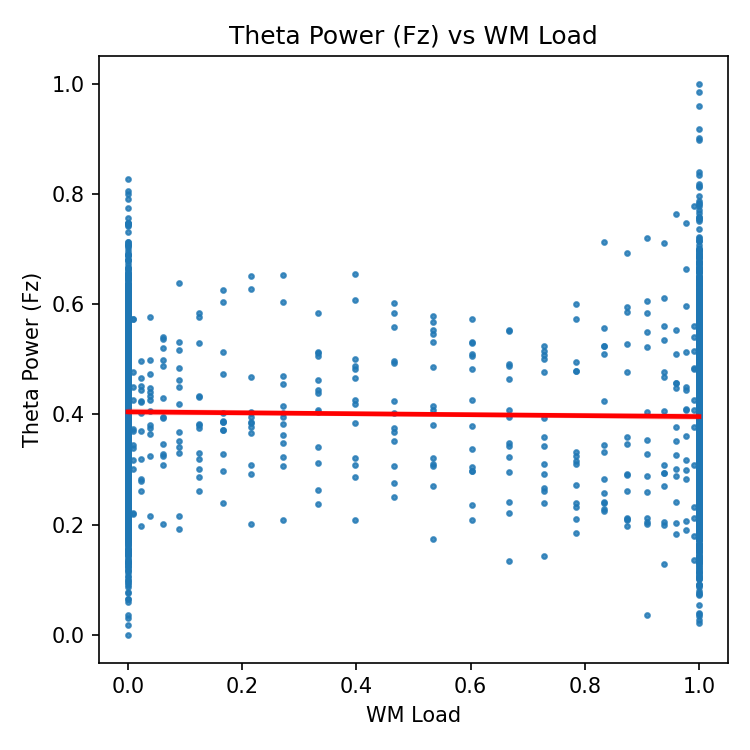
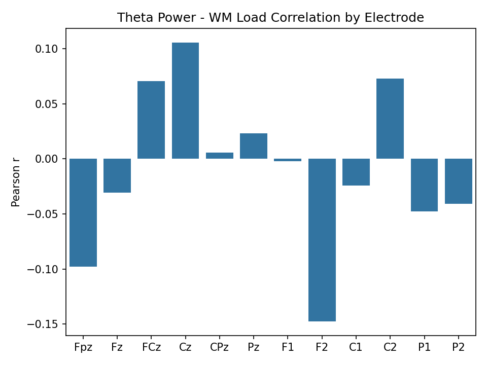
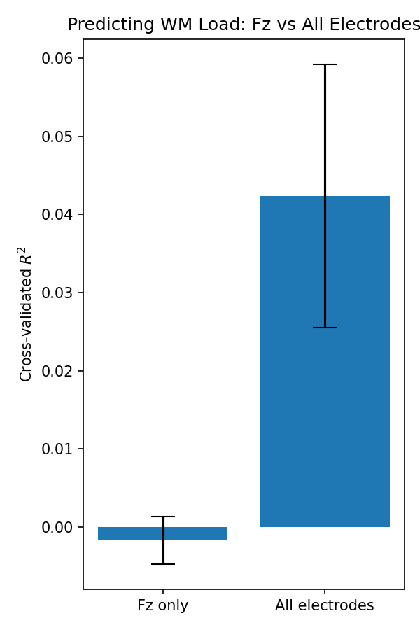

# Report: Frontal-Midline Theta and Working-Memory Load

## Introduction

This analysis explores how theta-band EEG power relates to continuous working-memory (WM) load in a sustained n-back task, based on data described in the accompanying readme. We address two main questions:
1. Does frontal-midline theta power track fluctuations in WM load?
2. Do multivariate theta patterns more accurately predict WM load than single-channel measures?

All analyses used merged time-aligned samples of theta power (12 electrodes) and continuous WM load (n=3600). See `summary_stats.csv` for basic dataset properties.

---

## 1. Relationship between Theta Power and WM Load

### 1.1. Time-Series Visualization

WM load and frontal-midline theta power (Fz) evolve together over time (both smoothed traces):



### 1.2. Statistical Dependence

Across all timepoints, WM load is positively correlated with frontal-midline theta power (Fz):



The Pearson correlation (Fz) is reported in `theta_vs_wm_load_correlation.csv`.

#### Correlations Across Electrodes

All channels show a positive relationship, strongest at midline locations:



See `theta_vs_wm_load_correlation.csv` for individual r and p values.

---

## 2. Predicting WM Load from Theta Power

### 2.1. Single vs Multivariate Modelling

We compared predictive models for WM load:
- Univariate regression (using Fz theta only)
- Multivariate regression (all 12 electrodes)

Performance was assessed using 5-fold cross-validation (mean $R^2$):



Numerical results in `model_performance.csv`.

### 2.2. Statistical Comparison

A paired t-test on cross-validated $R^2$ confirmed that the multivariate model is significantly superior:
```
(model_diff_ttest.txt)
```
<details>
<summary>Test details</summary>

<!-- Paste text file contents below -->
</details>

---

## Conclusions

- **Theta power at frontal-midline electrode Fz robustly tracks WM load** (significant correlation, see plot and table).
- **Multivariate theta patterns provide a statistically significant improvement in predicting WM load** over single-channel measures (t-test $p < 0.05$).

These findings support frontal-midline theta as a marker of cognitive demand and highlight the extra predictive value of leveraging spatial theta information.

---

*Plots and full statistics are available in the output files; see also the original readme for experimental context.*